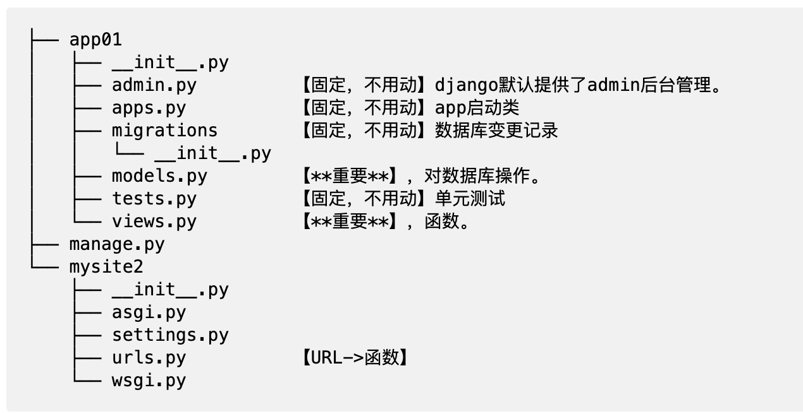
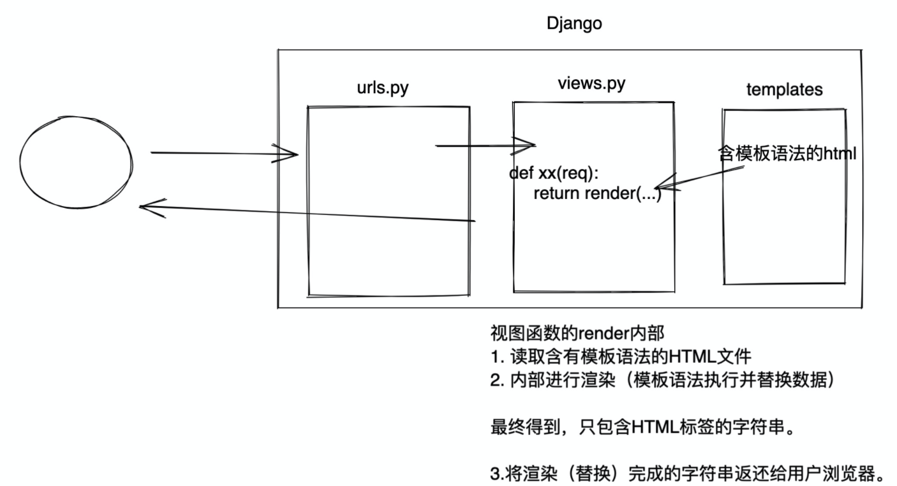
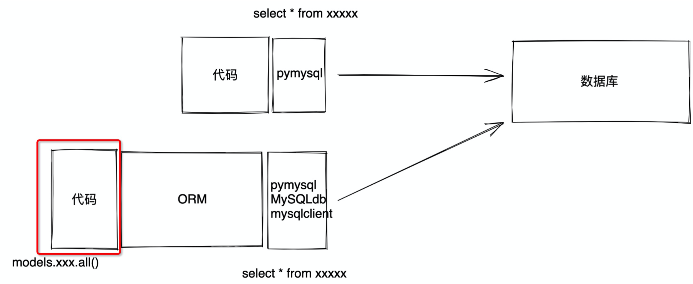

## 1. 安装Django
菜鸟教程：[https://www.runoob.com/django/django-tutorial.html](https://www.runoob.com/django/django-tutorial.html)

Django文档：[https://docs.djangoproject.com/zh-hans/3.2/](https://docs.djangoproject.com/zh-hans/3.2/)

```
pip install django

c:\python39
	- python.exe
	- Scripts
		- pip.exe
		- django-admin.exe   【工具，创建django项目中的文件和文件夹】
	- Lib
		- 内置模块
		- site-packages
			- openpyxl
			- python-docx
			- flask
			- django         【框架的源码】
```
## 2. 创建
### 创建项目
`django-admin startproject HelloWorld`
```
|-- HelloWorld
|   |-- __init__.py
|   |-- asgi.py    【接收网络请求】【不要动】
|   |-- settings.py【项目配置】 【常常修改】
|   |-- urls.py    【URL和函数的对应关系】【常常修改】
|   `-- wsgi.py    【接收网络请求】【不要动】
`-- manage.py      【项目的管理，启动项目、创建app、数据管理】【不要动】【常常用】
```
启动服务器：`python3 manage.py runserver 0.0.0.0:8000`
### 创建app
```
python3 manage.py startapp app01
```


## 3.快速上手
### 注册settings.py
```python
INSTALLED_APPS = [
	'django.contrib.admin',
	'django.contrib.auth',
	'django.contrib.contenttypes',
	'django.contrib.sessions',
	'django.contrib.messages',
	'django.contrib.staticfiles',

	'app01.apps.App01Config'
]
```
### url 和视图函数关系 urls.py 
```python
from app01 import views

urlpatterns = [
	# www.xxx.com/index/ -> 函数
	path('index/', views.index),
	path('user/list/', views.user_list),
	path('user/add/', views.user_add),
]
```
### 视图函数 views.py
```python
from django.shortcuts import render, HttpResponse, redirect

def index(request):
	return HttpResponse("欢迎使用")

def user_list(request):
	# 在app/templates目录中寻找
	return render(request, "user_list.html")

def user_add(request):
	return render(request, 'user_add.html')
```
### 启动
```
python manage.py runserver
```
## 4. 模版templates
### 静态文件static
1. 创建文件夹 css img js plugins
2. 引入
```html


<link rel="stylesheet" href="">


<script src=""></script>
<script src=""></script>
```
### 模板语法
#### views.py
```python
def tpl(request):
	name = "韩超发方法"
	roles = ["管理员", "CEO", "保安"]
	user_info = {"name": "郭智", "salary": 100000, 'role': "CTO"}
	data_list = [
	{"name": "郭智", "salary": 100000, 'role': "CTO"},
	{"name": "卢慧", "salary": 100000, 'role': "CTO"},
	{"name": "赵建先", "salary": 100000, 'role': "CTO"},
	]
	return render(request, 'tpl.html', {"n1": name, "n2": roles, 'n3': user_info, "n4": data_list})
```
#### tpl.html
```html
<div>{{ n1 }}</div>
<div>{{ n2 }}</div>

<div>{{ n2.0 }}</div>
<div>{{ n2.1 }}</div>
<div>{{ n2.2 }}</div>


	<span>{{ item }}</span>
		


{{ n3 }}
{{ n3.name }}
{{ n3.salary }}
{{ n3.role }}

<ul>
	<li>{{ k }} = {{ v }} </li>
		
</ul>

{{ n4.1 }}
{{ n4.1.name }}
{{ n4.1.role }}

	<div>{{ item.name }} {{ item.salary }}</div>



	<h1>哒哒哒哒哒</h1>

	<h1>嘟嘟嘟嘟</h1>



	<h1>哒哒哒哒哒</h1>

	<h1>哔哔哔</h1>

	<h1>嘟嘟嘟嘟</h1>

```

## 5.案例： 登录
views.py
```python
def login(request):
	if request.method == "GET":
		return render(request, "login.html")
		
	# 如果是POST请求，获取用户提交的数据
	username = request.POST.get("user")
	password = request.POST.get("pwd")
	
	if username == 'root' and password == "123":
		return redirect("http://www.baidu.com.cn/")
		
	return render(request, 'login.html', {"error_msg": "用户名或密码错误"})
```
```html
<h1>用户登录</h1>
<form method="post" action="/login/">
	
	<input type="text" name="user" placeholder="用户名">
	<input type="password" name="pwd" placeholder="密码">
	<input type="submit" value="提交"/>
	<span style="color: red;">{{ error_msg }}</span>
</form>
```
## 6.数据操作
MySQL数据库 + pymysql
```python
import pymysql
# 1.连接MySQL 
conn = pymysql.connect(host="127.0.0.1", port=3306, user='root', passwd="root123", charset='utf8', db='unicom') 
cursor = conn.cursor(cursor=pymysql.cursors.DictCursor) 
# 2.发送指令 
cursor.execute("insert into admin(username,password,mobile) values('wupeiqi','qwe123','15155555555')") 
conn.commit()
# 3.关闭 
cursor.close() 
conn.close()
```
Django开发操作数据库

#### 安装第三方模块
```
pip install mysqlclient
```
### ORM
-   创建、修改、删除数据库中的表（不用你写SQL语句）【无法创建数据库】
-   操作表中的数据（不用写SQL语句）
#### 1.创建数据库
-   启动MySQL服务
-   自带工具创建数据库
```mysql
create database testday15 DEFAULT CHARSET utf8 COLLATE utf8_general_ci;
```
#### 2.连接数据库
settings.py
```python
DATABASES = { 
		'default': { 
			'ENGINE': 
			'django.db.backends.mysql', 
			'NAME': 'gx_day15', # 数据库名字 
			'USER': 'root', 
			'PASSWORD': 'root123', 
			'HOST': '127.0.0.1', # 那台机器安装了MySQL 
			'PORT': 3306, } 
			}
```
#### 3.操作数据库
models.py
```python
class UserInfo(models.Model):
	name = models.CharField(max_length=32)
	password = models.CharField(max_length=64)
	age = models.IntegerField(default=2)
	
class Department(models.Model):
	title = models.CharField(max_length=16)
```
#### 4.执行命令 
将表放入数据库
```
python manage.py makemigrations 
python manage.py migrate
```
#### 5.数据：增删改查
```python
from app01.models import Department, UserInfo

def orm(request):
 1.新建 
	 Department.objects.create(title="销售部")
	 Department.objects.create(title="IT部")
	 Department.objects.create(title="运营部")
	 
	 UserInfo.objects.create(name="武沛齐", password="123", age=19)
	 UserInfo.objects.create(name="朱虎飞", password="666", age=29)
	 UserInfo.objects.create(name="吴阳军", password="666")
	 
2.删除 
	UserInfo.objects.filter(id=3).delete()
	Department.objects.all().delete()

3.获取数据 
3.1 获取符合条件的所有数据 data_list = [对象,对象,对象] QuerySet类型
	data_list = UserInfo.objects.all()
	for obj in data_list:
		print(obj.id, obj.name, obj.password, obj.age)
	data_list = [对象,]
	data_list = UserInfo.objects.filter(id=1)
	print(data_list)

3.2 获取第一条数据【对象】
	row_obj = UserInfo.objects.filter(id=1).first()
	print(row_obj.id, row_obj.name, row_obj.password, row_obj.age)

4.更新数据 
	UserInfo.objects.all().update(password=999)
	UserInfo.objects.filter(id=2).update(age=999)
	UserInfo.objects.filter(name="朱虎飞").update(age=999)
	return HttpResponse("成功")
```
