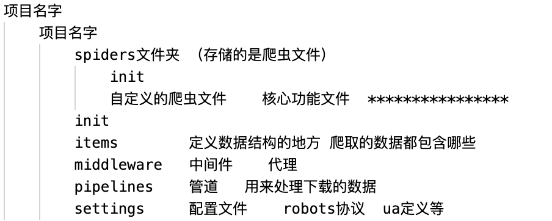
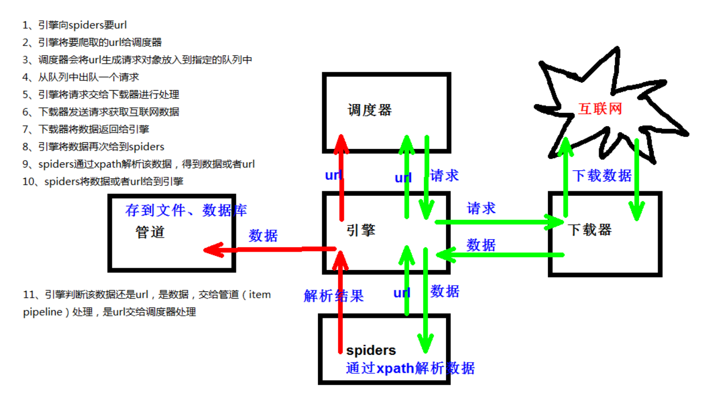
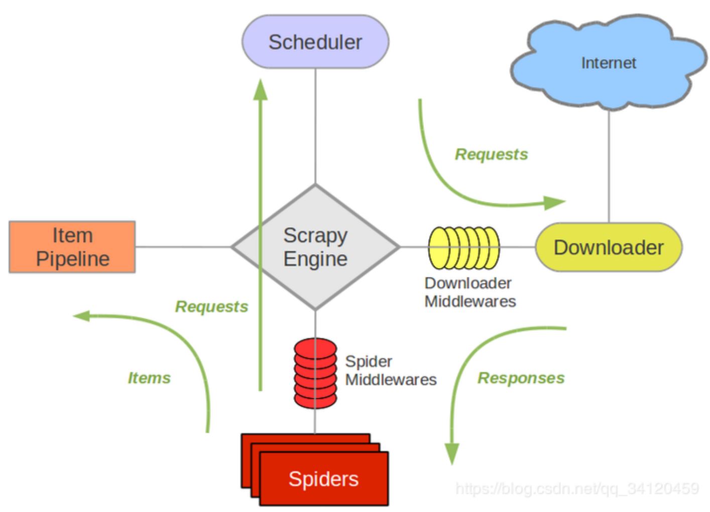
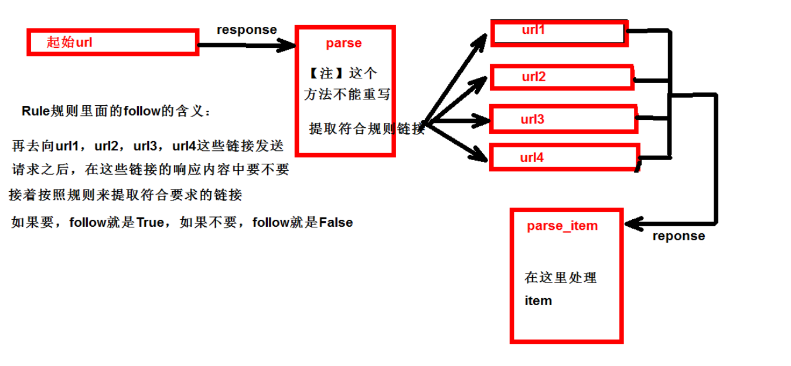

## Scrapy
Scrapy是一个为了爬取网站数据，提取结构性数据而编写的应用框架。 

可以应用在包括数据挖掘，信息处理或存储历史数据等一系列的程序中。

安装：`pip install scrapy`

创建：`scrapy startproject test01`

项目结构：

### 创建文件
```python
1. 创建爬虫的项目 scrapy startproject 项目的名字

注意：项目的名字不允许使用数字开头 也不能包含中文

2. 创建爬虫文件

要在spiders文件夹中去创建爬虫文件
cd 项目的名字\项目的名字\spiders
cd scrapy_baidu_091\scrapy_baidu_091\spiders

创建爬虫文件
scrapy genspider 爬虫文件的名字 要爬取网页
eg：scrapy genspider baidu http://www.baidu.com

一般情况下不需要添加http协议 因为start_urls的值是根据allowed_domains
修改的 所以添加了http的话 那么start_urls就需要我们手动去修改了

3. 运行爬虫代码
scrapy crawl 爬虫的名字
eg：scrapy crawl baidu
```
### 文件组成
```python
继承scrapy.Spider类
name = 'baidu'       运行爬虫文件时使用的名字
allowed_domains      爬虫允许的域名，在爬取的时候，如果不是此域名之下的url，会被过滤掉

start_urls           声明了爬虫的起始地址，可以写多个url，一般是一个
parse(self, response)解析数据的回调函数

response.text        响应的是字符串
response.body       响应的是二进制文件
response.xpath()    xpath方法的返回值类型是selector列表
extract()           提取的是selector对象的是data
extract_first()     提取的是selector列表中的第一个数据
```
### 案例：汽车之家
```python
class CarSpider(scrapy.Spider):
    name = 'car'
    allowed_domains = ['https://car.autohome.com.cn/price/brand-15.html']
    # 注意如果你的请求的接口是html为结尾的 那么是不需要加/的
    start_urls = ['https://car.autohome.com.cn/price/brand-15.html']
    def parse(self, response):
        name_list = response.xpath('//div[@class="main-title"]/a/text()')    
        price_list = response.xpath('//div[@class="main-lever"]//span/span/text()')
        for i in range(len(name_list)):
            name = name_list[i].extract()
            price = price_list[i].extract()
            print(name,price)
```
### 架构构成
1. 引擎 ：自动运行，无需关注，会自动组织所有的请求对象，分发给下载器
2. 下载器 ：从引擎处获取到请求对象后，请求数据
3. spiders：Spider类定义了如何爬取某个(或某些)网站。包括了爬取的动作(例如:是否跟进链接)以及如何从网页的内容中提取结构化数据(爬取item)。 换句话说，Spider就是您定义爬取的动作及分析某个网页(或者是有些网页)的地方。
4. 调度器：有自己的调度规则，无需关注
5. 管道（Item pipeline） ：最终处理数据的管道，会预留接口供我们处理数据当Item在Spider中被收集之后，它将会被传递到Item Pipeline，一些组件会按照一定的顺序执行对Item的处理。每个item pipeline组件(有时称之为“Item Pipeline”)是实现了简单方法的Python类。他们接收到Item并通过它执行一些行为，同时也决定此Item是否继续通过pipeline，或是被丢弃而不再进行处理。

以下是item pipeline的一些典型应用：

1. 清理HTML数据
2. 验证爬取的数据(检查item包含某些字段)
3. 查重(并丢弃)
4. 将爬取结果保存到数据库中


## Scrapy shell

是一个交互终端，供您在未启动spider的情况下尝试及调试您的爬取代码。

其本意是用来测试提取数据的代码，不过您可以将其作为正常的Python终端，在上面测试任何的Python代码。

该终端是用来测试XPath或CSS表达式，查看他们的工作方式及从爬取的网页中提取的数据。

### ipython
`pip install ipython`

### 使用
```
# 终端
scrapy shell www.baidu.com

In [**3**]: response.url
Out[**3**]: 'http://www.baidu.com'

In [**4**]: response.status
Out[**4**]: 200
```
### 语法
```python
response对象：
response.body
response.text
response.url
response.status

response的解析：
response.xpath() （常用）使用xpath路径查询特定元素，返回一个selector列表对象
response.css()   使用css_selector查询元素，返回一个selector列表对象
获取内容 ：response.css('#su::text').extract_first()
获取属性 ：response.css('#su::attr(“value”)').extract_first()

selector对象（通过xpath方法调用返回的是seletor列表）
extract()   提取selector对象的值,如果提取不到值 那么会报错
使用xpath请求到的对象是一个selector对象，需要进一步使用extract()方法拆包，转换为unicode字符串
extract_first()  提取seletor列表中的第一个值
xpath()
css()
注意：每一个selector对象可以再次的去使用xpath或者css方法
```
## 案例：当当网
### 创建
```
scrapy startproject sracpy_dangdang
cd sracpy_dangdang\sracpy_dangdang\spider
scrapy gensipder dang https://book.dangdang.com/01.21.htm
scrapy crawl dang
```
### items
```python
import scrapy
class ScrapyDangdangItem(scrapy.Item):
	# 图片
	src = scrapy.Field()
	# 名字
	name = scrapy.Field()
	# 价格
	price = scrapy.Field()
```
### pipelines
```python
from itemadapter import ItemAdapter
# 如果想使用管道的话 那么就必须在settings中开启管道

class ScrapyDangdangPipeline:
    def open_spider(self,spider):
        self.fp = open('book.json','w',encoding='utf-8')
    
    def process_item(self, item, spider):
    self.fp.write(str(item))
        return item
        
    def close_spider(self,spider):
        self.fp.close()

import urllib.request

# 多条管道开启

# (1) 定义管道类
# （2） 在settings中开启管道
# 'scrapy_dangdang_095.pipelines.DangDangDownloadPipeline':301

class DangDangDownloadPipeline:
    def process_item(self, item, spider):
        url = 'http:' + item.get('src')
        filename = './books/' + item.get('name') + '.jpg'
        urllib.request.urlretrieve(url = url, filename= filename)
        return item
```
### setting
```python
ITEM_PIPELINES = {

# 管道可以有很多个 那么管道是有优先级的 优先级的范围是1到1000 值越小优先级越高
'scrapy_dangdang.pipelines.ScrapyDangdang095Pipeline': 300,

# DangDangDownloadPipeline
'scrapy_dangdang.pipelines.DangDangDownloadPipeline':301
}
```
### dang.py
```python
import scrapy
from scrapy_dangdang.items import ScrapyDangdangItem

class DangSpider(scrapy.Spider):
    name = 'dang'
    allowed_domains = ['category.dangdang.com']
    start_urls = ['http://category.dangdang.com/cp01.01.02.00.00.00.html']
    base_url = 'http://category.dangdang.com/pg'
    page = 1
    
    def parse(self, response):
    li_list = response.xpath('//ul[@id="component_59"]/li')
    for li in li_list:
        src = li.xpath('.//img/@data-original').extract_first()
        if src:
            src = src
        else:
	        src = li.xpath('.//img/@src').extract_first()
	        name = li.xpath('.//img/@alt').extract_first()
	        price = li.xpath('.//p[@class="price"]/span[1]/text()').extract_first()
	        book = ScrapyDangdang095Item(src=src,name=name,price=price)
	        # 获取一个book就将book交给pipelines
		  yield book

# 每一页的爬取的业务逻辑全都是一样的，所以我们只需要将执行的那个页的请求再次调用parse方法

if self.page < 100:
	self.page = self.page + 1
	url = self.base_url + str(self.page) + '-cp01.01.02.00.00.00.html'
	yield scrapy.Request(url=url,callback=self.parse)
```
#### yield
1. 带有 yield 的函数不再是一个普通函数，而是一个生成器generator，可用于迭代
2. yield 是一个类似 return 的关键字，迭代一次遇到yield时就返回yield后面(右边)的值。重点是：下一次迭代时，从上一次迭代遇到的yield后面的代码(下一行)开始执行
3. 简要理解：yield就是 return 返回一个值，并且记住这个返回的位置，下次迭代就从这个位置后(下一行)开始

## mysql
1. 下载:[https://dev.mysql.com/downloads/windows/installer/5.7.html](https://dev.mysql.com/downloads/windows/installer/5.7.html)

3. 安装: [https://jingyan.baidu.com/album/d7130635f1c77d13fdf475df.html](https://jingyan.baidu.com/album/d7130635f1c77d13fdf475df.html)
### pysql
```mysql
1.pip install pymysql

2.pymysql.connect(host,port,user,password,db,charset)

3.conn.cursor()

4.cursor.execute()
```
## CrawlSpider
1. 继承自scrapy.Spider

2. CrawlSpider可以定义规则，再解析html内容的时候，可以根据链接规则提取出指定的链接，然后再向这些链接发送请求

所以，如果有需要跟进链接的需求，意思就是爬取了网页之后，需要提取链接再次爬取，使用CrawlSpider是非常合适的

3. 提取链接
```python
scrapy.linkextractors.LinkExtractor(
	allow = (), # 正则表达式 提取符合正则的链接
	deny = (), # (不用)正则表达式 不提取符合正则的链接
	allow_domains = (), #（不用）允许的域名
	deny_domains = (), #不用）不允许的域名
	restrict_xpaths = (), # xpath，提取符合xpath规则的链接
	restrict_css = () # 提取符合选择器规则的链接)
```
4. 模拟使用
```python
正则用法：links1 = LinkExtractor(allow=r'list_23_\d+\.html')

xpath用法：links2 = LinkExtractor(restrict_xpaths=r'//div[@class="x"]')

css用法：links3 = LinkExtractor(restrict_css='.x')
```

5.提取连接
```python
link.extract_links(response)
```

### 案例：读书网
1. 创建项目：scrapy startproject dushuproject

2. 跳转到spiders路径 cd\dushuproject\dushuproject\spiders

3. 创建爬虫类：scrapy genspider ‐t crawl read www.dushu.com

4. items
```python
import scrapy
class ScrapyReadbook101Item(scrapy.Item):
	name = scrapy.Field()
	src = scrapy.Field()
```
5. spiders
```python
import scrapy
from scrapy.linkextractors import LinkExtractor
from scrapy.spiders import CrawlSpider, Rule
from scrapy_readbook_101.items import ScrapyReadbook101Item

class ReadSpider(CrawlSpider):
	name = 'read'
	allowed_domains = ['www.dushu.com']
	start_urls = ['https://www.dushu.com/book/1188_1.html']
	rules = (
		Rule(LinkExtractor(allow=r'/book/1188_\d+.html'),
		callback='parse_item',
		follow=True),)
	
	def parse_item(self, response):
		img_list = response.xpath('//div[@class="bookslist"]//img')
		for img in img_list:
			name = img.xpath('./@data-original').extract_first()
			src = img.xpath('./@alt').extract_first()
			book = ScrapyReadbook101Item(name=name,src=src)
			yield book
```
6. settings
```python
# 参数中一个端口号 一个是字符集 都要注意
DB_HOST = '192.168.231.130'
# 端口号是一个整数
DB_PORT = 3306
DB_USER = 'root'
DB_PASSWROD = '1234'
DB_NAME = 'spider01'

# utf-8的杠不允许写
DB_CHARSET = 'utf8'

ITEM_PIPELINES = {
	'scrapy_readbook_101.pipelines.ScrapyReadbook101Pipeline': 300,
	'scrapy_readbook_101.pipelines.MysqlPipeline':301
}
```
7. pipelines
```python
from itemadapter import ItemAdapter

class ScrapyReadbook101Pipeline:
	def open_spider(self,spider):
		self.fp = open('book.json','w',encoding='utf-8')
	
	def process_item(self, item, spider):
		self.fp.write(str(item))
		return item
		
	def close_spider(self,spider):
	self.fp.close()
	
# 加载settings文件
from scrapy.utils.project import get_project_settings
import pymysql

class MysqlPipeline:
	def open_spider(self,spider):
		settings = get_project_settings()
		self.host = settings['DB_HOST']
		self.port =settings['DB_PORT']
		self.user =settings['DB_USER']
		self.password =settings['DB_PASSWROD']
		self.name =settings['DB_NAME']
		self.charset =settings['DB_CHARSET']
		self.connect()
		
	def connect(self):
		self.conn = pymysql.connect(
			host=self.host,
			port=self.port,
			user=self.user,
			password=self.password,
			db=self.name,
			charset=self.charset
			)
			
		self.cursor = self.conn.cursor()
		
	def process_item(self, item, spider):
		sql = 'insert into book(name,src) values("{}"{}")'.format(item['name'],item['src'])

		self.cursor.execute(sql)
		self.conn.commit()
		return item
	
	def close_spider(self,spider):
		self.cursor.close()
		self.conn.close()
```
## 日志信息和日志等级
1. 日志级别：

CRITICAL：严重错误

ERROR： 一般错误

WARNING： 警告

INFO: 一般信息

DEBUG： 调试信息

2. settings.py文件设置：

默认的级别为DEBUG，会显示上面所有的信息

在配置文件中 settings.py

LOG_FILE : 将屏幕显示的信息全部记录到文件中，屏幕不再显示，注意文件后缀一定是.log

LOG_LEVEL : 设置日志显示的等级，就是显示哪些，不显示哪些

## post 请求
1. 重写start_requests方法：def start_requests(self)

2. start_requests的返回值：

`scrapy.FormRequest(url=url, headers=headers, callback=self.parse_item, formdata=data)`

url: 要发送的post地址

headers：可以定制头信息

callback: 回调函数

formdata: post所携带的数据，这是一个字典
```python
import scrapy
import json

class TestpostSpider(scrapy.Spider):
	name = 'testpost'
	allowed_domains = ['https://fanyi.baidu.com/sug']
	
	def start_requests(self):
		url = 'https://fanyi.baidu.com/sug'
		data = {
		'kw': 'final'
		}
	yield scrapy.FormRequest(url=url,formdata=data,callback=self.parse_second)
	
	def parse_second(self,response):
		content = response.text
		obj = json.loads(content,encoding='utf-8')
		print(obj)
```