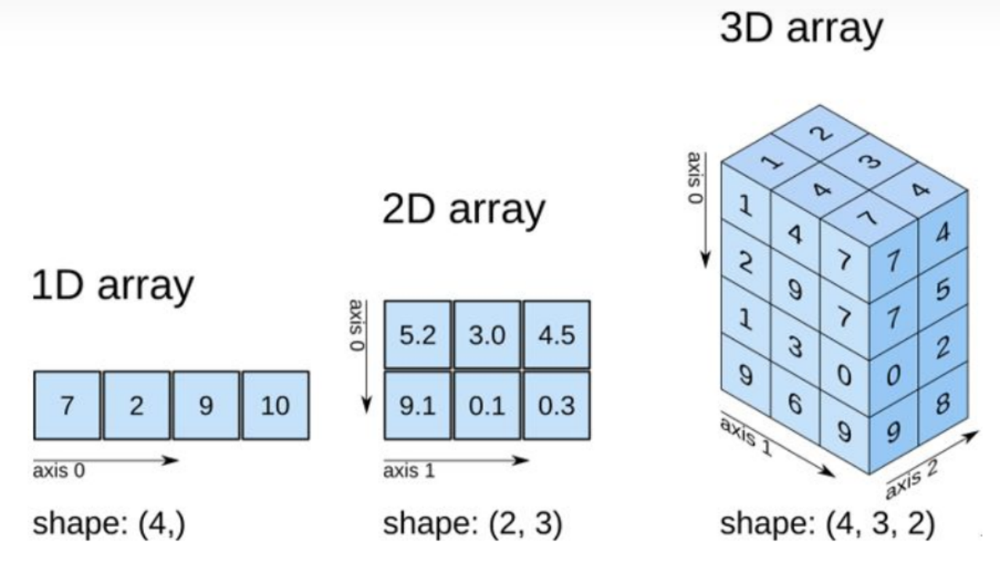
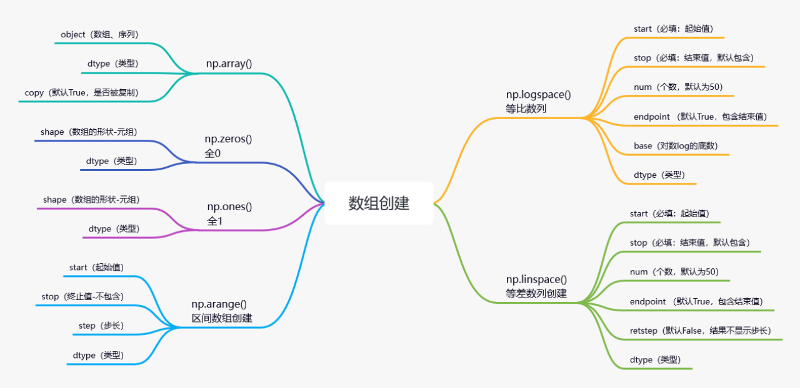
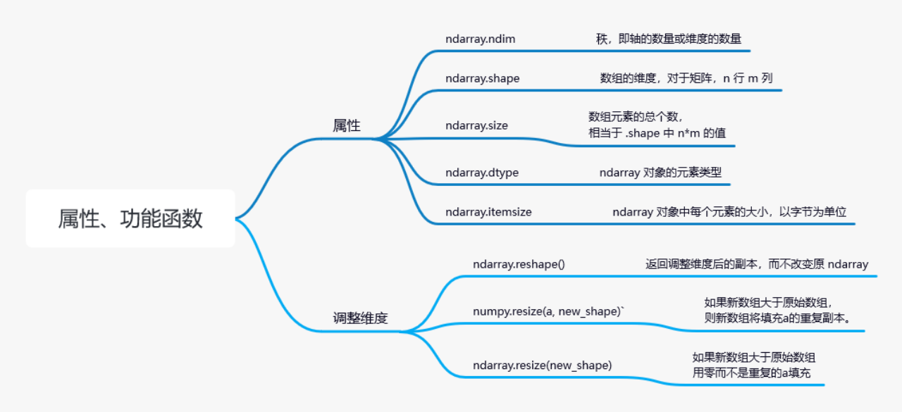

## 1. 定义
NumPy 定义了一个 n 维数组对象，简称 ndarray 对象
它是一个一系列相同类型元素组成的数组集合。
数组中的每个元素都占有大小相同的内存块 

ndarray 对象采用了数组的**索引**机制，
将数组中的每个元素**映射**到内存块上
并且按照一定的布局对内存块进行排列(行或列)。


## 2. 数组 array
### a.创建数组
```python
numpy.array(object, dtype = None, copy = True, order = None,subok=False,ndmin = 0)
```
| 序号 | 参数     | 描述说明                                                               |
|----|--------|--------------------------------------------------------------------|
| 1  | object | 表示一个数组序列。                                                          |
| 2  | dtype  | 可选参数，通过它可以更改数组的数据类型                                                |
| 3  | copy   | 可选参数，当数据源是ndarray时表示数组能否被复制，默认是 True。                              |
| 4  | order  | 可选参数，以哪种内存布局创建数组，有 3 个可选值，分别是 C(行序列)/F(列序列)/A(默认)。                 |
| 5  | ndmin  | 可选参数，用于指定数组的维度。                                                    |
| 6  | subok  | 可选参数，类型为bool值，默认False。为True，使用object的内部数据类型；False：使用object数组的数据类型。 |

```python
#array()函数，括号内可以是列表、元祖、数组、迭代对象,生成器等

# 数组
np.array([1,2,3,4,5])

# 元组
np.array((1,2,3,4,5))

# 迭代对象
np.array(range(10))

# 生成器
np.array([i**2 for i in range(10)])
```

### b. object 元素类型不相同 
数据类型会变成大的
```python
# 字符串
np.array([1,1.5,3,4.5,'5']) 
#  array(['1', '1.5', '3', '4.5', '5'], dtype='<U32') 

# 浮点型
ar2 = np.array([1,2,3.14,4,5])
# array([1.  , 2.  , 3.14, 4.  , 5.  ]) 

# 二维数组：嵌套序列（列表，元祖均可）
ar3 = np.array([
                [1,2,3],
                ('a','b','c')
               ]) 

# array([['1', '2', '3'],
#        ['a', 'b', 'c']], dtype='<U11')
```

### c. dtype 参数
```python
a = np.array([1,2,3,4,5])
print(a)
# 设置数组元素类型
has_dtype_a = np.array([1,2,3,4,5],dtype='float')
has_dtype_a
# [1.,2.,3.,4.,5.]

# 浮点数变整数
np.array([1.1,2.5,3.8,4,5],dtype='int')
# array([1, 2, 3, 4, 5])
```

### d. copy 参数 True
```python
a = np.array([1,2,3,4,5])

1. 定义b，复制a

b = np.array(a)   # 地址不一样 a: 2066732212352   b: 2066732213153

# 修改b a无变化
b[0] = 10         #  a: [1 2 3 4 5]   b: [10  2  3  4  5]

2. 两个变量会指向相同的内容地址，没有创建新的对象

b = np.array(a, copy=False)  #地址一样 a: 2066732267520   b: 2066732267520
 
# 修改b a变化
b[0] = 10        # a: [10  2  3  4  5]   b: [10  2  3  4  5]

```
#### 3种复制方法
```python
a = np.array([2,4,3,1])

# 1.使用np.array()
b = np.array(a)  # 2066731363744 2066731901216

# 2.使用数组的copy()方法
c = a.copy()    # 2066732267520 2066731901216

# 3.=会使2个变量指向相同的内存地址
d = a           #  2066731901216 2066731901216
                # 修改d也会相应的修改a
```
### e. ndmin纬度
```python
a = np.array([1,2,3])    # [1 2 3]

a = np.array([1,2,3], ndmin=2)  # array([[[1, 2, 3]]])
 
```
### f. subok 
```python
# True: object内部数据类型。 False：object数据类型，默认

a = np.mat([1,2,3,4])         # <class 'numpy.matrix'>

at = np.array(a,subok=True)   # <class 'numpy.matrix'>

af = np.array(a)              # <class 'numpy.ndarray'>

```
## 2. arange 区间数组
```python
numpy.arange(start, stop, step, dtype)
```
| 序号 | 参数    | 描述说明                               |
|----|-------|------------------------------------|
| 1  | start | 起始值，默认为0                           |
| 2  | stop  | 终止值（不包含）                           |
| 3  | step  | 步长，默认为1                            |
| 4  | dtype | 返回ndarray的数据类型，如果没有提供，则会使用输入数据的类型。 |
```python
# 1.整数
np.arange(10)  # array([0, 1, 2, 3, 4, 5, 6, 7, 8, 9])

# 2.浮点
np.arange(3.1) # array([0., 1., 2., 3.])
               # range 可不行，会报错
               
# 3.指定类型
x = np.arange(5, dtype =  float) 

# 4. 起始10 ，终止值20 步长2
np.arange(10,20,2)  # array([10, 12, 14, 16, 18])

```

## 3. linspace 等差数列
在线性回归中作为样本集
```python
np.linspace(start, stop, num=50, endpoint=True, retstep=False, dtype=None)
```
| 序号 | 参数       | 描述说明                                 |
|----|----------|--------------------------------------|
| 1  | start    | 必填项，序列的起始值，                          |
| 2  | stop     | 必填项，序列的终止值，如果endpoint为true，该值包含于数列中  |
| 3  | num      | 要生成的等步长的样本数量，默认为50                   |
| 4  | endpoint | 该值为 true 时，数列中包含stop值，反之不包含，默认是True。 |
| 5  | retstep  | 如果为 True 时，生成的数组中会显示间距，反之不显示。        |
| 6  | dtype    | ndarray 的数据类型                        |
```python
 1. endpoint
a = np.linspace(1,10,10)

# array([ 1.,  2.,  3.,  4.,  5.,  6.,  7.,  8.,  9., 10.])

a = np.linspace(1,10,endpoint=False)

# array([1.  , 1.18, 1.36, 1.54, 1.72, 1.9 , 2.08, 2.26, 2.44, 2.62, 2.8 ,
#       2.98, 3.16, 3.34, 3.52, 3.7 , 3.88, 4.06, 4.24, 4.42, 4.6 , 4.78,
#       4.96, 5.14, 5.32, 5.5 , 5.68, 5.86, 6.04, 6.22, 6.4 , 6.58, 6.76,
#       6.94, 7.12, 7.3 , 7.48, 7.66, 7.84, 8.02, 8.2 , 8.38, 8.56, 8.74,
#       8.92, 9.1 , 9.28, 9.46, 9.64, 9.82])

2. restep算步长

ar1 = np.linspace(2.0,3.0,num=5, retstep=True) 
# (array([2.  , 2.25, 2.5 , 2.75, 3.  ]), 0.25)
```

## 4. logspace等比数列

```python
np.logspace(start, stop, num=50, endpoint=True, base=10.0, dtype=None)
```
| 序号 | 参数       | 描述说明                                 |
|----|----------|--------------------------------------|
| 1  | start    | 必填项，序列的起始值，                          |
| 2  | stop     | 必填项，序列的终止值，如果endpoint为true，该值包含于数列中  |
| 3  | num      | 要生成的等步长的样本数量，默认为50                   |
| 4  | endpoint | 该值为 true 时，数列中包含stop值，反之不包含，默认是True。 |
| 5  | base     | 对数 log 的底数                           |
| 6  | dtype    | ndarray 的数据类型                        |
```python
1.
a = np.logspace(0,9,10,base=2)
# 2的0次方，2的9次方，一共十个数
# array([  1.,   2.,   4.,   8.,  16.,  32.,  64., 128., 256., 512.])

2. 取得1到2之间10个常用对数
np.logspace(1.0,2.0,num=10)
```

## 5.全0全1数列
```python
numpy.zeros(shape, dtype = float, order = 'C')
numpy.ones(shape, dtype = None, order = 'C')

```
| 序号 | 参数  | 描述说明       |
| ---- | ----- | -------------- |
| 1    | shape | 数组形状       |
| 2    | dtype | 数据类型，可选 |
### 全0数列
```python
1. 默认为浮点数 
np.zeros(5)  # array([0., 0., 0., 0., 0.])

2. 2行2列的全0数组
np.zeros((2,2))

# array([[0., 0.],
#        [0., 0.]])

3.zeros_like返回具有与给定数组相同的形状和类型的零数组

ar1 = np.array([[1,2,3],[4,5,6]])
np.zeros_like(ar1)
# array([[0, 0, 0],
#        [0, 0, 0]])
```

### 全1数列
```python
ar5 = np.ones(9)       # [1. 1. 1. 1. 1. 1. 1. 1. 1.]
ar6 = np.ones((2,3,4))
ar7 = np.ones_like(ar5)
```
## 6 数组属性

| 属性               | 说明                           |
|------------------|------------------------------|
| ndarray.ndim     | 秩，即轴的数量或维度的数量                |
| ndarray.shape    | 数组的维度，对于矩阵，n 行 m 列           |
| ndarray.size     | 数组元素的总个数，相当于 .shape 中 `n*m` 的值 |
| ndarray.dtype    | ndarray 对象的元素类型              |
| ndarray.itemsize | ndarray 对象中每个元素的大小，以字节为单位    |
### a. shape & reshape
```python
a = np.array([1,2,3,4,5])
a.shape   # (5,)

b = np.array([[1, 2, 3], [4, 5, 6]])
b.shape   # (2, 3)

c = np.array([
    [
        [1, 2, 3],
        [4, 5, 6]
    ],
    [
        [11, 22, 33],
        [44, 55, 66]
        ]
    ])
c.shape    # (2, 2, 3)


a = np.array([1,2,3,4,5,6])
b = a.reshape((2,3)) 

# b： [[1 2 3]
#    [4 5 6]]
```
### b. size & resize
```python

a = np.array([[1,2,3],[4,5,6]])
a.size   # 6

a=np.array([
        [0,1],
        [2,3]
    ])
b_2_3 = np.resize(a,(2,10))

# 原数填充
# array([[0, 1, 2, 3, 0, 1, 2, 3, 0, 1],
#      [2, 3, 0, 1, 2, 3, 0, 1, 2, 3]])

```

### c. ndim
```python
a = np.array([1,2,3,4,5,6])  
b = a.reshape((2,3))         
a.ndim     # 1
b.ndim     # 2
```
### e. dtype
```python
a = np.array([1,2,3,4,5,6])
a.dtype   # int64

b = np.array([1.1,2,3,4,5,6])
b.dtype   # float64

```
### d.itemsize
```python
a = np.array([1.1,2.2,3.3]) 
a.itemsize  # 8

```


