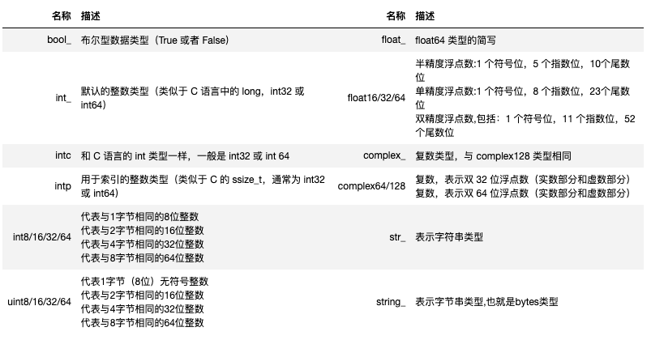
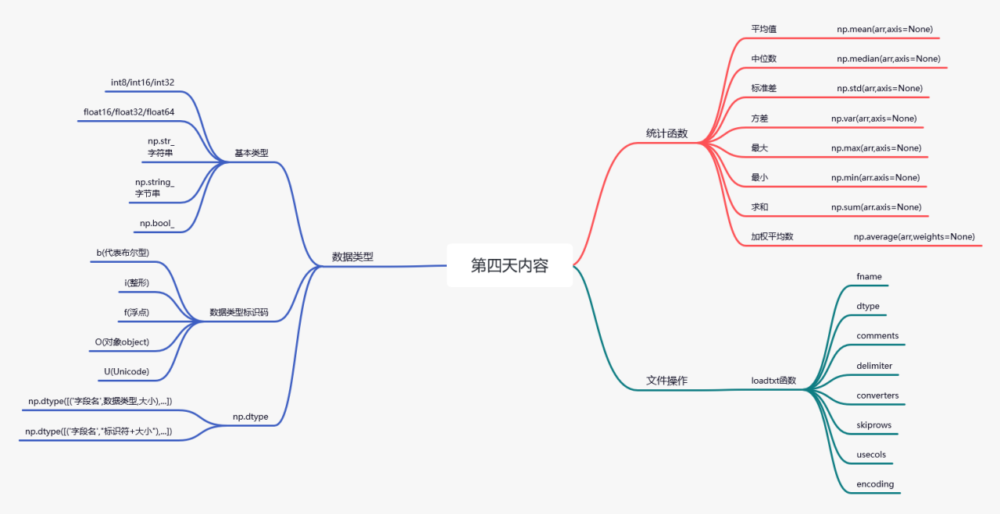

# Numpy：数据类型


## 定义结构化数据
| 字符  | 对应类型          | 字符 | 对应类型            | 字符 | 对应类型           | 字符 | 对应类型     |
|-----|---------------|----|-----------------|----|----------------|----|----------|
| b   | 代表布尔型         | i  | 带符号整型           | u  | 无符号整型          | f  | 浮点型      |
| c   | 复数浮点型         | m  | 时间间隔（timedelta） | M  | datatime（日期时间） | O  | Python对象 |
| S,a | 字节串（S）与字符串（a） | U  | Unicode         | V  | 原始数据（void）     |

```python
teacher = np.dtype([('name',np.str_,2), ('age', 'i1'), ('salary', 'f4')])
# 将其应用于ndarray对象
b = np.array([('wl', 32, 8357.50),
              ('lh', 28, 7856.80)
             ], dtype = teacher) 
             
# [('wl', 32, 8357.5) ('lh', 28, 7856.8)]

```
