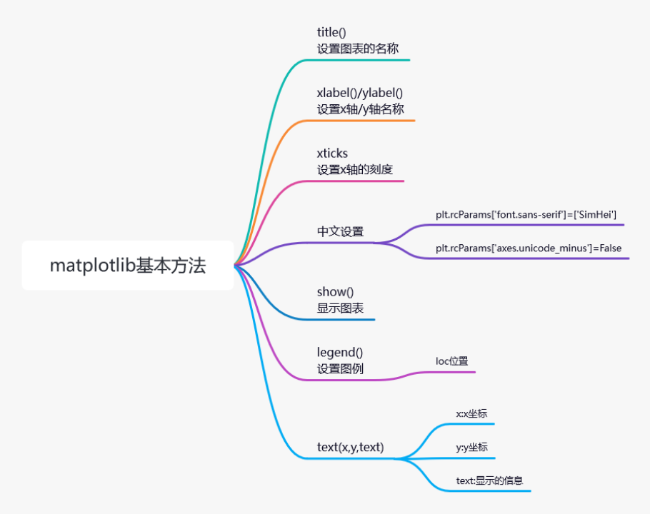

# matplotlib

菜鸟课程：[https://www.runoob.com/matplotlib/matplotlib-tutorial.html](https://www.runoob.com/matplotlib/matplotlib-tutorial.html)
官网：[https://matplotlib.org/](https://matplotlib.org/)

## 安装
```python
pip install matplotlib

import matplotlib
matplotlib.__version__ # '3.5.3'

# 引入
from matplotlib import pyplot as plt
```

## 修改字体配置
| 中文字体       | 说明   |
|------------|------|
| ‘SimHei’   | 中文黑体 |
| ‘Kaiti’    | 中文楷体 |
| ‘LiSu’     | 中文隶书 |
| ‘FangSong’ | 中文仿宋 |
| ‘YouYuan’  | 中文幼圆 |
| STSong     | 华文宋体 |

```python
# 使用中文需要进行配置信息的设置
plt.rcParams['font.sans-serif'] = ["FangSong"]


# 解决方式: 修改轴中的负号编码
plt.rcParams['axes.unicode_minus'] = False

```
## 基本方法
| 方法名                          | 说明                   |
|------------------------------|----------------------|
| title()                      | 设置图表的名称              |
| xlabel()                     | 设置x轴名称               |
| ylabel()                     | 设置y轴名称               |
| xticks(ticks,label,rotation) | 设置x轴的刻度,rotation旋转角度 |
| yticks()                     | 设置y轴的刻度              |
| show()                       | 显示图表                 |
| legend()                     | 显示图例                 |
| text(x,y,text)               | 显示每条数据的值 x,y值的位置     |
### 1. title
```python
x = np.arange(-50,50)
y = x**2
plt.title('y=x^2')
plt.plot(x,y)
```

### 2. x 轴和y 轴  xlabel
```python
plt.xlabel('x 轴', fontsize = 12) # 设置文字大小
plt.ylabel('y 轴')
plt.plot(x,y,linewidth = 5)  # 设置线条
```
### 3.刻度 xticks
```python
matplotlib.pyplot.xticks(ticks=None, labels=None, **kwargs)
matplotlib.pyplot.yticks(ticks=None, labels=None, **kwargs)

times = ['2015/6/26', '2015/8/1', '2015/9/6', '2015/10/12', '2015/11/17','2015/12/23','2016/1/28','2016/3/4','2016/4/9',
'2016/5/15','2016/6/20','2016/7/26','2016/8/31','2016/10/6','2016/11/11','2016/12/17']


plt.xticks(range(0,len(times),2),labels=['日期:%s'%i for i in times], rotation=45, color='red')
plt.plot(times,sales)

```
### 4. 显示 show
```python
# 如果在jupyter中也想出现图形操作菜单
matplotlib notebook

# 如果有想回去原先的展示
%matplotlib inline
```
### 5. 图例 legend
```python
# 每个时间点的销量绘图
times = ['2015/6/26', '2015/8/1', '2015/9/6', '2015/10/12', '2015/11/17','2015/12/23','2016/1/28','2016/3/4','2016/4/9',
'2016/5/15','2016/6/20','2016/7/26','2016/8/31','2016/10/6','2016/11/11','2016/12/17']

# 随机出收入
income =np.random.randint(500,2000,size=len(times))
# 支出
expenses =np.random.randint(300,1500,size=len(times))

# 绘制图形
plt.xticks(range(1,len(times),2),rotation=45)
# 注意,在使用图例前为每个图形设置label参数
plt.plot(times,income,label="收入")
plt.plot(times,expenses,label="支出")

plt.legend(loc="upper left")

# 每条数据的值 x,y值的位置
for x,y in zip(times,income):
    plt.text(x,y,'%s万'%y)
```
| 位置字符串          | 位置值 | 备注        |
|----------------|-----|-----------|
| "best"         | 0   | 自动寻找最好的位置 |
| "upper right"  | 1   | 右上角       |
| "upper left"   | 2   | 左上角       |
| "lower left"   | 3   | 左下角       |
| "lower right"  | 4   | 右下角       |
| "right"        | 5   | 右边中间      |
| "center left"  | 6   | 左边中间      |
| "center right" | 7   | 右边中间      |
| "lower center" | 8   | 中间最下面     |
| "upper center" | 9   | 中间最上面     |
| "center"       | 10  | 正中心       |

>text:
>   x,y:表示坐标值上的值
> string:表示说明文字
> fontsize:表示字体大小
> verticalalignment：(va)垂直对齐方式 ，参数：[ ‘center’ | ‘top’ | ‘bottom’ | ‘baseline’ ]
> horizontalalignment：(ha)水平对齐方式 ，参数：[ ‘center’ | ‘right’ | ‘left’ ]




## 设置
```python
# 引入Matplotlib引入
from matplotlib import pyplot as plt
import numpy as np
import pandas as pd

# 设置中文字体
plt.rcParams['font.sans-serif'] = ['SimHei']
# 中文负号
plt.rcParams['axes.unicode_minus'] = False

# 设置分别率 为100
plt.rcParams['figure.dpi'] = 100

# 设置大小
plt.rcParams['figure.figsize'] = (5,3)

```
