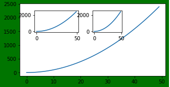
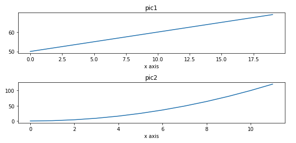
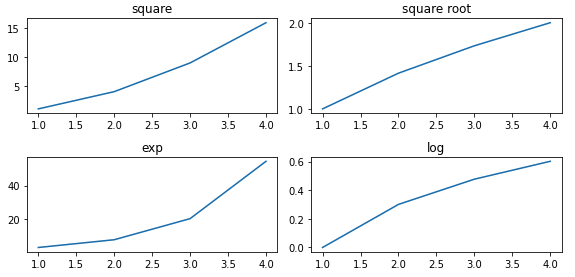

## 1.plot图形样式
### 1. 网格 grid
```python
plt.grid(True, linestyle = "--",color = "gray", linewidth = "0.5",axis = 'x')

x = np.linspace(-np.pi,np.pi,256,endpoint = True)
c, s = np.cos(x), np.sin(x)
plt.plot(x, c)
plt.plot(x, s)
# 通过ndarry创建图表
#plt.grid(True, linestyle = "--",color = "gray", linewidth = "0.5",axis = 'both')
plt.grid(True,linestyle="--")
```
### 2.坐标轴操作 gca
```python
x = np.arange(-50,51)
y = x ** 2

# 获取当前坐标轴
ax = plt.gca()
# 通过坐标轴spines,确定 top, bottom, left, right (分别表示上,下,左和右)

# 不需要右侧和上侧线条,则可以设置他的颜色
ax.spines['right'].set_color("none")
ax.spines['top'].set_color("none")


# 在这里，position位置参数有三种，data , outward(向外-可自行尝试) , axes
# axes:0.0 - 1.0之间的值，整个轴上的比例
ax.spines['left'].set_position(('axes',0.5))
plt.ylim(0, y.max()) # 设置轴取值范围

plt.plot(x, y)
```
### 3. rcParams 画图分辨率，大小
-   默认的像素：[6.0,4.0]，分辨率为72，图片尺寸为 432x288
-   指定dpi=100，图片尺寸为 600*400
-   指定dpi=300，图片尺寸为 1800*1200
```python
# 尺寸
plt.rcParams['figure.figsize'] = (6.0, 4.0)

# 指定分辨率 dpi=100，图片尺寸为 600*400
plt.rcParams['figure.dpi'] = 100
```

## 2.线条样式参数
```python
plt.plot(x,y,color='red',alpha=0.3,linestyle='-',linewidth=5,marker='o',markeredgecolor='r',markersize='20',markeredgewidth=10)


x= np.arange(0, 100,10)
y= x ** 2

"""linewidth 设置线条粗细
   label 设置线条标签
   color 设置线条颜色
   linestyle 设置线条形状
   marker 设置线条样点标记
"""

plt.plot(x, y, linewidth = '2', label = "test", color='b', linestyle='--', marker='H')
plt.legend(loc='upper left')

# 线条样式缩写
plt.plot([2,4,5],[3,8,7],'m+--')
```
## 3.创建图形对象figure
### 1.创建图形
```python
plt.figure(
    num=None,------------------------------------> 图像编号或名称，数字为编号 ，字符串为名称
    figsize=None,--------------------------------> 指定figure的宽和高，单位为英寸；
    dpi=None,------------------------------------> 定绘图对象的分辨率，即每英寸多少个像素，缺省值为72
    facecolor=None,------------------------------> 背景颜色
    edgecolor=None, -----------------------------> 边框颜色
    frameon=True, -------------------------------> 是否显示边框
    **kwargs,
)
```

```python
from matplotlib import pyplot as plt
# 创建图形对象,相当于我们创建一个画布
fig = plt.figure('f1',figsize=(4,2), dpi=100,facecolor='gray')

ax = plt.gca()
ax.plot(x,y)
plt.plot(x,y)
```
### 2. 绘制多子图
#### 添加区域 add_axes()
```python
fig = plt.figure(figsize=(4,2),facecolor='g')

# ax1从画布起始位置绘制,宽高和画布一致
ax1 = fig.add_axes([0,0,1,1])

# ax2 从画布 10% 的位置开始绘制, 宽高是画布的 30%
ax2=fig.add_axes([0.1,0.6,0.3,0.3])

ax3=fig.add_axes([0.5,0.6,0.2,0.3])

ax1.plot(x, y)
ax2.plot(x, y)
ax3.plot(x, y)

```

#### 划分画布 subplot()
```python
ax = plt.subplot(nrows, ncols, index,*args, **kwargs)
-   nrows 行
-   ncols 列
-   index: 索引
-   kwargs: title/xlabel/ylabel 等..
```
#####  a.在创建的时候直接设置
```python
#现在创建一个子图，它表示一个有2行1列的网格的顶部图。
#--------------- 第一个区域---------------
plt.subplot(211,title="pic1", xlabel="x axis")
# x可省略,默认[0,1..,N-1]递增
plt.plot(range(50,70))

#--------------------第二区域-----------
plt.subplot(212, title="pic2", xlabel="x axis")

plt.plot(np.arange(12)**2)

# 紧凑的布局
plt.tight_layout()
```

##### b. 使用pyplot模块中的方法设置后再绘制
```python 

#--------------- 第一个区域---------------
plt.subplot(211)
# 使用图形对象:
plt.title("ax1")
# x可省略,默认[0,1..,N-1]递增
plt.plot(range(50,70))

#--------------------第二区域-----------
plt.subplot(212)
plt.title("ax2")

#...其他的自己设置

plt.plot(np.arange(12)**2)
# 紧凑的布局
plt.tight_layout()

```
##### c. 使用返回的区域对象设置
```python
#--------------- 第一个区域 ax1---------------
ax1 = plt.subplot(211)
# 使用区域对象:
ax1.set_title("ax1")
# x可省略,默认[0,1..,N-1]递增
ax1.plot(range(50,70))

#--------------------第二区域 ax2-----------
ax2 = plt.subplot(212)
ax2.set_title("ax2")

#...其他的自己设置

ax2.plot(np.arange(12)**2)
# 紧凑的布局
plt.tight_layout()
```
#### subplots()🌟
```python
fig , ax = plt.subplots(nrows, ncols)

# 引入模块
import matplotlib.pyplot as plt
import numpy as np

# 创建2行2列的子图,返回图形对象(画布),所有子图的坐标轴
fig, axes =  plt.subplots(2,2)

x = np.arange(1,5)
#绘制平方函数
axes[0][0].plot(x, x*x)
axes[0][0].set_title('square')
#绘制平方根图像
axes[0][1].plot(x, np.sqrt(x))
axes[0][1].set_title('square root')
#绘制指数函数
axes[1][0].plot(x, np.exp(x))
axes[1][0].set_title('exp')

#绘制对数函数
axes[1][1].plot(x,np.log10(x))
axes[1][1].set_title('log')

# 处理标题遮挡
plt.tight_layout()

plt.show()
```
