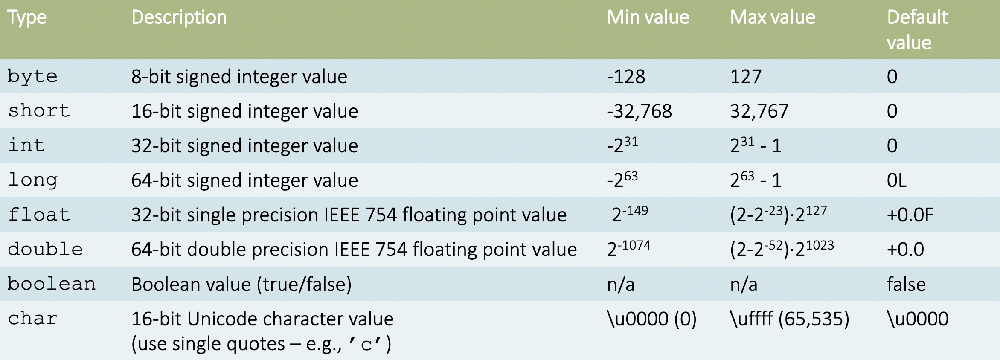

## 1. Variables
### 1.1 Types
statically typed (静态类型)：must be declared
1. variables: int i
2. class: class C {boolean b;}
3. method parameter  : public float getValue(long l ){...}
```java
int i;
i = 5;
```

### 1.2 String
1. "" 
2. immutable
### 1.3 Operator
1. =
2. == ,  !=
3. <, >, <=, >= 
4. &&, ||
### 1.4 conversions
在存储之前必须把类型转好
#### a. implicit conversions (隐式转换) widening
byte -> long -> double

精度会丢失，数字会保留
```java
int i = 500
long l = i
double d = l;
```
### b.Explicit conversions(显示转换) narrowing
1. double -> float: loss function 
	1. 超出则 infinite
	2. non-zore  -> zero
2. double / float  ->  long / int / short / byte / char
	1. 向0舍
	2. 超出，infinite
3. integer -> small
```java
int i = 1025;
byte b = (byte)i;    // 1
```
4. String
```java
int i = Integer.parseInt("42")  //42
```
	1. + 
	2. String.valueof()
### d. Division
1. both integers (int, long, short, byte, char): integer division
2. either floating-point (float, double):  floating point division
```java
7.0 / 4.0  // 1.75
7 / 4      // 1

float b= 5.2f;
int a = 2;

b/a   //2.6
```
## 2. Statement
### 2.1 If
```java
If (condition1)  
	block1  
else if (condition2)  
	block2  
	// ...  
else  
	blockN
```
### 2.2 for
```java
for (int i = 0; i < 10; i++) {  
	doSomething();  
}
```
### 2.3 while
```java
while (condition) {  
	doSomething();  
}
```
#### break continue
```java
for (...; ...; i<10)
while (!valid)
```
1. continue : 跳过，继续执行
2. break： break out
### 2.4 switch
Integer: byte, short, int, long, char, enum
## 3. Method
### 3.1 Declared
1. modifers
2. return
3. method name
4. parameter
5. exception
6. method body
```java
public double calculateAnswer(double wingSpan, int numberOfEngines,  
double length, double grossTons) {  
	//do the calculation here  
}
```
### 3.2 calling
```java
double result = calculateAnswer(10, 4, 100, 1000);
```
### 3.3 return
```java
double doSomething(double a) {  
	return 0 – a;  
}

int doSomething(String s) {  
	return s.length();  
}
```
### 3.4 overloading重载
1. two methods with the same name 
2. have different parameter lists 
 
## 4.Array
### 4.1 array
1. type
2. dimension
```java
int[]

String[][]
```
Not:
1. reserve space
2. length
just:
1. reference to point to the array
### 4.2 initializing
```java
int[] values = new int[10]
int[] values = {10, 20, 30, 40, 50}
```
### 4.3 access
```java
int value = values[3]
String[][] strings = // ..;
system.out.println(strings[i][j])
```
### 4.4 length
```java
strings.length
```
### 4.5 iterating
```java
String[] fruits = new String[] { “apple”, “banana”, “cherry” ];  
// 1. loop  
for (int i = 0; i < fruits.length; i++) {  
	System.out.println(fruits[i]);  
}  
// 2.for-each  
for (String fruit : fruits) {  
	System.out.println (fruit);  
}
```