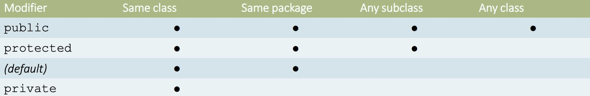

## 1.Object
### 1.1 Objects
1. state
2. behavior

| object              | Class     |
| ------------------- | --------- |
| instances of types  | types     |
| instance of a class | blueprint |
### 1.2 Method of java.lang.Object
```java
protected Object clone()
boolean equals(Object obj)
protected void finalize()
public Class<?> getClass()
public int hashCode()
public void notify() / notifyAll()
public String toString()
public void wait() / wait(long timeout) / wait(longtimeout, int nanos)
```

## 2.class
```java
class BankAccount{
	//fields
	private int balance;
	private String name;
	private static int NEXT_ID = 0;
	
	//Method
	public void deposit(int value){
	this.balance += value;
	}
	public void withdraw(int value){
	this.balance -= value;
	}
	
	//Constructor
	public BankAccount(String name, int initialAmount){
	this.name = name;
	this.balance = initialAmount;
	this.id = BankAccount.NEXT_ID++;
	}
	
	//Getter and Setter
	public String getName(){
	return name
	}
	public void setName(String name){
	this.name = name;
	}
}
BankAccount b = new BankAccount('Marry',0)
b.value += 1000;
b.name = 'Eve'
```
### 2.1 fields
attributes : name, size, age...
 1. local variables : in a method
 2. method parameters: in a method header
 3. member variables in a class: fields
### 2.2 methods
behavior: eat(), sleep(), walk()
### 2.3 Constructor
1. like method (with the same name as the class)
2. no return type
3. create a new object: 
```java
publci Bycycle(){
	this.gear = 0;
	this.cadence = 0;
	this.speed = 0;
}
```
1. constructor are not members, **not inherited by subclasses**
2. constructor of superclass can be invoked from the subclass
可以从子类调用超类的构造函数
```java

public class MountainBike extends Biycycle{
	public int seaHeight;
	public MounntainBike(int seatHeight, int cadence, int speed, int gear{
	// super
	super(cadence,speed,gear);
	
	this.seatHeigh = seatHeigh;
	}
}

```
### 2.4 Modifier（修饰器）

### 2.5 Static
1. static field (静态字段): Double.MAX_VALUE, System.out
2. static method: Math.random(), Integer.parseInt()
## 3.Inheritance
```java
public class Animal{
	protected String name;
	
	public void move(){
	System.out.println(name + ' can move')
	}
	
	public String getName(){
	return this.name
	}
}

public class Dog extends Animal{
	private String breed;
	
	// overridding
	public void move(){
	System.outprintln(name + ' can walk and run')}
}
```
1. class can inherit state & behavior
2. A class have one superclass (if no , object)
3. subclasses can override superclass
### 3.1 subclass 子类
1. Fields: 
	1. use inherited fields
	2. declare a field same as superclass; hiding parent field
	3. declare a new field
2. Method: 
	1. use inherited  method
	2. override an instance method 
	3. hide a static method 
	4. declare a new methods that are not in the superclass
### 3.2 polymorphism 多态性
```java
Animal a1,a2;
a1 = new Animal();
a2 = new Dog();

a1.move()
a2.move()
```
## 4. Built-in methods 内建方法
1. toString(): String
2. equals(): compare
3. hashCode(): return an integer

```java
public String toString(){
	return "Account #" + id + "Name = " + name;
}
```