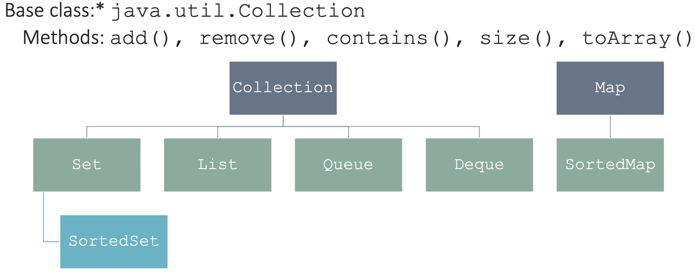
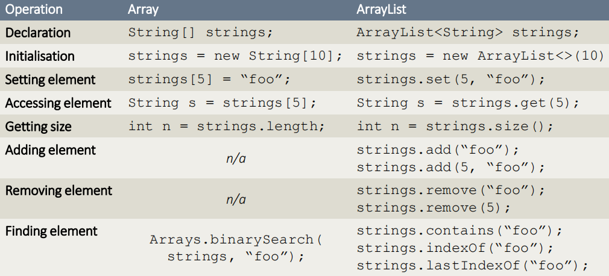

## 1. Packages
```java
package my.package.name;

import java.util.Scanner;
Sanner stdin = new Scanner(System.in)
```
## 2.Collections
1. ArrayList (array)
2. HashSet : unique
3. Stack: list (last-in first-out)
4. HashMap (dictionary)

### 2.1 ArrayList
1. class - elements can be added and removed by methods
2. capacity and size


| List                             | ArrayList                   |
| -------------------------------- | --------------------------- |
| high-level Collection            | specific type of List       |
| add, clear, isEmpty, remove, set | concrete implementation     |
|                                  | initializing a new variable |
```java
ArrayList<Integer> a = new ArrayList()
a.add(3)
a.contains(4)  //false
```
### 2.2 List : generic types 泛型
```java
List<String> StrList = new ArrayList<>()

strList.add('foo')

for (String s: words){
	System.out.println(s.toLowerCase())
}
```

### 2.3 Boxing and unboxing
1. `<type>` need to be a class; primitive types will not work
2. wrapper classes (int/Integer, long/Long)
4. automatically converts between wrapper classes and privative types
```java
List<Integer> intList = new ArrayList<>()

intList.add(5);
intList.add(10);
int value = intList.get(0);
Integer value2 = intList.get(1) * 100
```
### 2.4 Sets
1. HashSet, TreeSet, LinkHashSet
2. unique elements
```java
HashSet<String> h = new HashSet<String>();
h.add('hello');
h.contains("hello")  //true
h.remove("hello")
```
### 2.5 Maps
1. HashMap, TreeMap, LinkedHashMap
2. keys: values
3. get(key); put(key, value)
```java
HashMap<String,Double> h = new HashMap<String,Double>()
h.put("banana",3.0)
h.get("banana")  //3.0
h.keySet()  
```