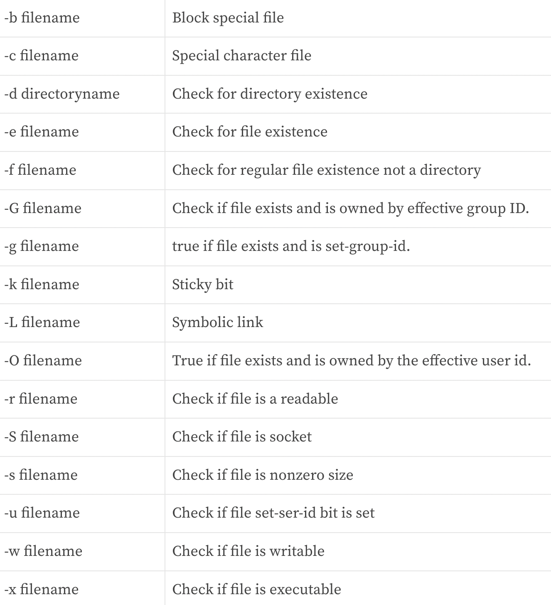

1. Bash: [https://linuxconfig.org/bash-scripting-tutorial](https://linuxconfig.org/bash-scripting-tutorial)
2. More in Bash: [https://www.howtogeek.com/67469/the-beginners-guide-to-shell-scripting-the-basics/](https://www.howtogeek.com/67469/the-beginners-guide-to-shell-scripting-the-basics/)
## 1. Bash 
### 1. 1First Bash Script
```bash
# 1.find located
which bash

# 2.create a file
nano hello.bash

# 3. edit
#!/bin/bash
# declare STRING variable
STRING="Hello World"
# print variable on a screen
echo $STRING

# 4. make executable
chmod +x hello.sh

# 5.execute
.hello.sh
```
### 1.2 Backup bash shell script 备份脚本
```bash
#!/bin/bash
tar -czf myhome_directory.tar.gz /home/linuxconfig
# compress tar file
```
## 2.Variables
### 2.1 Name backup
1. `$` : string

2. `echo` : stdout
```bash
#!/bin/bash
OF=myhome_directory_$(date +%Y%m%d).tar.gz
tar -czf $OF /home/linuxconfig

./backup.sh
```
### 2.2 Global vs Local 
```bash
#!/bin/bash
# Define bash global variable
# This variable is global and can be used anywhere in this bash script
VAR="global variable"

function bash {
# Define bash local variable
# This variable is local to bash function only
local VAR="local variable"
echo $VAR
}

echo $VAR
bash
# Note the bash global variable did not change
# "local" is bash reserved word
echo $VAR
```
Execute:
```bash
$ ./variables.sh
global variable
local variable
global variable
```
### 2.3 Passing arguments(传递参数)
```bash
#!/bin/bash
# use predefined variables to access passed arguments
# echo arguments to the shell
echo $1 $2 $3 ' -> echo $1 $2 $3'

# We can also store arguments from bash command line in special array
args=("$@")
#echo arguments to the shell
echo ${args[0]} ${args[1]} ${args[2]} ' -> args=("$@"); echo ${args[0]} ${args[1]} ${args[2]}'

#use $@ to print out all arguments at once
echo $@ ' -> echo $@'

# use $# variable to print out
# number of arguments passed to the bash script
echo Number of arguments passed: $# ' -> echo Number of arguments passed: $#'
```
Execute:
```bash
$ ./arguments.sh Bash Scripting Tutorial
Bash Scripting Tutorial  -> echo $1 $2 $3
Bash Scripting Tutorial  -> args=("$@"); echo ${args[0]} ${args[1]} ${args[2]}
Bash Scripting Tutorial  -> echo $@
Number of arguments passed: 3  -> echo Number of arguments passed: $#
```
## 3. Execute shell
### 3.1 Execute
1. `$()` : create a subshell
2. `uname -o` : running
```bash
#!/bin/bash
# use a subshell $() to execute shell command
echo $(uname -o)
# executing bash command without subshell
echo uname -o
```
```bash
$ uname -o
GNU/LINUX
$ ./subshell.sh
GNU/LINUX
uname -o
```
### 3.2 Input
`read` : read input
```bash
#!/bin/bash
 
echo -e "Hi, please type the word: \c "
read  word
echo "The word you entered is: $word"
echo -e "Can you please enter two words? "
read word1 word2
echo "Here is your input: \"$word1\" \"$word2\""
echo -e "How do you feel about bash scripting? "
# read command now stores a reply into the default build-in variable $REPLY
read
echo "You said $REPLY, I'm glad to hear that! "
echo -e "What are your favorite colours ? "
# -a makes read command to read into an array
read -a colours
echo "My favorite colours are also ${colours[0]}, ${colours[1]} and ${colours[2]}:-)"
```
Execute:
```bash
$ ./read.sh
Hi, please type the word: Linuxconfig.org
The word you entered is: Linuxconfig.org
Can you please enter two words? 
Debian Linux
Here is your input: "Debian" "Linux"
How do you feel about bash scripting? 
good
You said good, I'm glad to hear that! 
What are your favorite colours ? 
blue green black
My favorite colours are also blue, green and black:-)
```
### 3.3 Trap
`trap`
```bash
#!/bin/bash
# bash trap command
trap bashtrap INT
# bash clear screen command
clear;
# bash trap function is executed when CTRL-C is pressed:
# bash prints message => Executing bash trap subrutine !
bashtrap()
{
    echo "CTRL+C Detected !...executing bash trap !"
}
# for loop from 1/10 to 10/10
for a in `seq 1 10`; do
    echo "$a/10 to Exit." 
    sleep 1;
done
echo "Exit Bash Trap Example!!!"
```
Execute: CTRL +C
```bash
$ ./trap.sh
1/10 to Exit.
2/10 to Exit.
^CCTRL+C Detected !...executing bash trap !
3/10 to Exit.
4/10 to Exit.
5/10 to Exit.
6/10 to Exit.
7/10 to Exit.
^CCTRL+C Detected !...executing bash trap !
8/10 to Exit.
9/10 to Exit.
10/10 to Exit.
Exit Bash Trap Example!!!
```
### 3.4 Redirect
```bash
#!/bin/bash
echo "Redirect this STDOUT to STDERR" 1>&2
```

## 4.Arrays
### 4.1 array
```bash
#!/bin/bash
#Declare array with 4 elements
ARRAY=( 'Debian Linux' 'Redhat Linux' Ubuntu Linux )
# get number of elements in the array
ELEMENTS=${#ARRAY[@]}

# echo each element in array 
# for loop
for (( i=0;i<$ELEMENTS;i++)); do
    echo ${ARRAY[${i}]}
done
```
Execute:
```bash
$ ./arrays.sh
Debian Linux
Redhat Linux
Ubuntu
Linux
```
### 4.2 Read file into bash
```bash
#!/bin/bash
# Declare array
declare -a ARRAY
# Link filedescriptor 10 with stdin
exec 10<&0
# stdin replaced with a file supplied as a first argument
exec < $1
let count=0

while read LINE; do
    ARRAY[$count]=$LINE
    ((count++))
done

echo Number of elements: ${#ARRAY[@]}
# echo array's content
echo ${ARRAY[@]}
# restore stdin from filedescriptor 10
# and close filedescriptor 10
exec 0<&10 10<&-
```
Execute:
```bash
$ cat bash.txt
Bash
Scripting
Tutorial
Guide
$ ./bash-script.sh bash.txt 
Number of elements: 4
Bash Scripting Tutorial Guide
```
## 5. Statement
### 5.1 if-else
```bash
#!/bin/bash
directory="./BashScripting"

# bash check if directory exists
if [ -d $directory ]; then
	echo "Directory exists"
else 
	echo "Directory does not exist"
fi
```
Execute:
```bash
$ ./bash_if_else.sh
Directory does not exist
$ mkdir BashScripting
$ ./bash_if_else.sh
Directory exists
```
### 5.2 for
```bash
#!/bin/bash
# bash for loop
for f in $( ls /var/ ); do
	echo $f
done

$ for f in $( ls /var/ ); do echo $f; done
```
### 5.3 while
```bash
#!/bin/bash
COUNT=6
# bash while loop
while [ $COUNT -gt 0 ]; do
	echo Value of count is: $COUNT
	let COUNT=COUNT-1
done
```
### 5.4 utile
```bash
#!/bin/bash
COUNT=0
# bash until loop
until [ $COUNT -gt 5 ]; do
        echo Value of count is: $COUNT
        let COUNT=COUNT+1
done
```
### 5.5 select
```bash
#!/bin/bash
PS3='Choose one word: ' 
# bash select
select word in "linux" "bash" "scripting" "tutorial" 
do
  echo "The word you have selected is: $word"
# Break, otherwise endless loop
  break  
done

exit 0
```
Execute:
```bash
$ ./select.sh
1) linux
2) bash
3) scripting
4) tutorial
Choose one word: 2
The word you have selected is: bash
```
### 5.6 Case
```bash
#!/bin/bash
echo "What is your preferred programming / scripting language"
echo "1) bash"
echo "2) perl"
echo "3) phyton"
echo "4) c++"
echo "5) I do not know !"
read case;
#simple case bash structure
# note in this case $case is variable and does not have to
# be named case this is just an example
case $case in
    1) echo "You selected bash";;
    2) echo "You selected perl";;
    3) echo "You selected phyton";;
    4) echo "You selected c++";;
    5) exit
esac
```
Execute:
```bash
$ ./case.sh 
What is your preferred programming / scripting language
1) bash
2) perl
3) phyton
4) c++
5) I do not know !
3
You selected phyton
```
## 6. Operation
### 6.1 Comparison 
| char | sys  |
| ---- | ---- |
| -lt  | `<`  |
| -gt  | `>`  |
| -le  | `<=` |
| -ge  | `>=` |
| -eq  | `==` |
| -ne  | `!=` |

```bash
#!/bin/bash
# declare integers
NUM1=2
NUM2=1
if   [ $NUM1 -eq $NUM2 ]; then
	echo "Both values are equal"
elif [ $NUM1 -gt $NUM2 ]; then
	echo "NUM1 is greater than NUM2"
else 
	echo "NUM2 is greater than NUM1"
fi
```
Execute:
```bash
$ ./statement.sh
NUM1 is greater than NUM2
```
### 6.2 String 
| sys     | string       |
| ------- | ------------ |
| `=`     | equal        |
| `!=`    | not equal    |
| `<`     | less than    |
| `>`     | greater than |
| `-n sl` | not empty    |
| `-z sl` | empty        |
```bash
#!/bin/bash
#Declare string S1
S1="Bash"
#Declare string S2
S2="Bash"
if [ $S1 = $S2 ]; then
	echo "Both Strings are equal"
else 
	echo "Strings are NOT equal"
fi
```
Execute:
```bash
$ ./statement.sh
Both Strings are equal
```
### 6.3 Bash Arithmetic
```bash
#!/bin/bash
 
echo '### let ###'
# bash addition
let ADDITION=3+5
echo "3 + 5 =" $ADDITION

# bash subtraction
let SUBTRACTION=7-8
echo "7 - 8 =" $SUBTRACTION 

# bash multiplication
let MULTIPLICATION=5*8
echo "5 * 8 =" $MULTIPLICATION

# bash division
let DIVISION=4/2
echo "4 / 2 =" $DIVISION

# bash modulus
let MODULUS=9%4
echo "9 % 4 =" $MODULUS

# bash power of two
let POWEROFTWO=2**2
echo "2 ^ 2 =" $POWEROFTWO


echo '### Bash Arithmetic Expansion ###'
# There are two formats for arithmetic expansion: $[ expression ] 
# and $(( expression #)) its your choice which you use

echo 4 + 5 = $((4 + 5))
echo 7 - 7 = $[ 7 - 7 ]
echo 4 x 6 = $((3 * 2))
echo 6 / 3 = $((6 / 3))
echo 8 % 7 = $((8 % 7))
echo 2 ^ 8 = $[ 2 ** 8 ]


echo '### Declare ###'

echo -e "Please enter two numbers \c"
# read user input
read num1 num2
declare -i result
result=$num1+$num2
echo "Result is:$result "

# bash convert binary number 10001
result=2#10001
echo $result

# bash convert octal number 16
result=8#16
echo $result

# bash convert hex number 0xE6A
result=16#E6A
echo $result
```
Execute:
```bash
$ ./arithmetic_operations.sh 
### let ###
3 + 5 = 8
7 - 8 = -1
5 * 8 = 40
4 / 2 = 2
9 % 4 = 1
2 ^ 2 = 4
### Bash Arithmetic Expansion ###
4 + 5 = 9
7 - 7 = 0
4 x 6 = 6
6 / 3 = 2
8 % 7 = 1
2 ^ 8 = 256
### Declare ###
Please enter two numbers 23 45
Result is:68 
17
14
3690
```
### 6.4 Float
`bc`
```bash
#!/bin/bash
# Simple linux bash calculator 
echo "Enter input:" 
read userinput
echo "Result with 2 digits after decimal point:"
echo "scale=2; ${userinput}" | bc 
echo "Result with 10 digits after decimal point:"
echo "scale=10; ${userinput}" | bc 
echo "Result as rounded integer:"
echo $userinput | bc
```
Execute:
```bash
$ ./simple_bash_calc.sh
Enter input:
10/3.4
Result with 2 digits after decimal point:
2.94
Result with 10 digits after decimal point:
2.9411764705
Result as rounded integer:
2
```
## 7.File

## 8.Function
```bash
!/bin/bash
# BASH FUNCTIONS CAN BE DECLARED IN ANY ORDER
function function_B {
        echo Function B.
}
function function_A {
        echo $1
}
function function_D {
        echo Function D.
}
function function_C {
        echo $1
}
# FUNCTION CALLS
# Pass parameter to function A
function_A "Function A."
function_B
# Pass parameter to function C
function_C "Function C."
function_D
```
Execute:
```bash
$ ./functions.sh
Function A.
Function B.
Function C.
Function D.
```