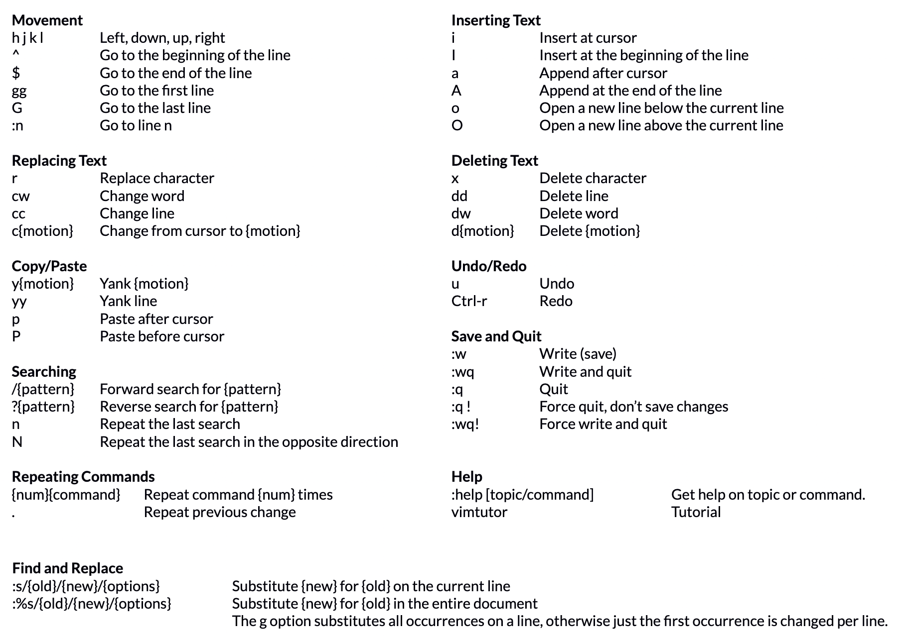
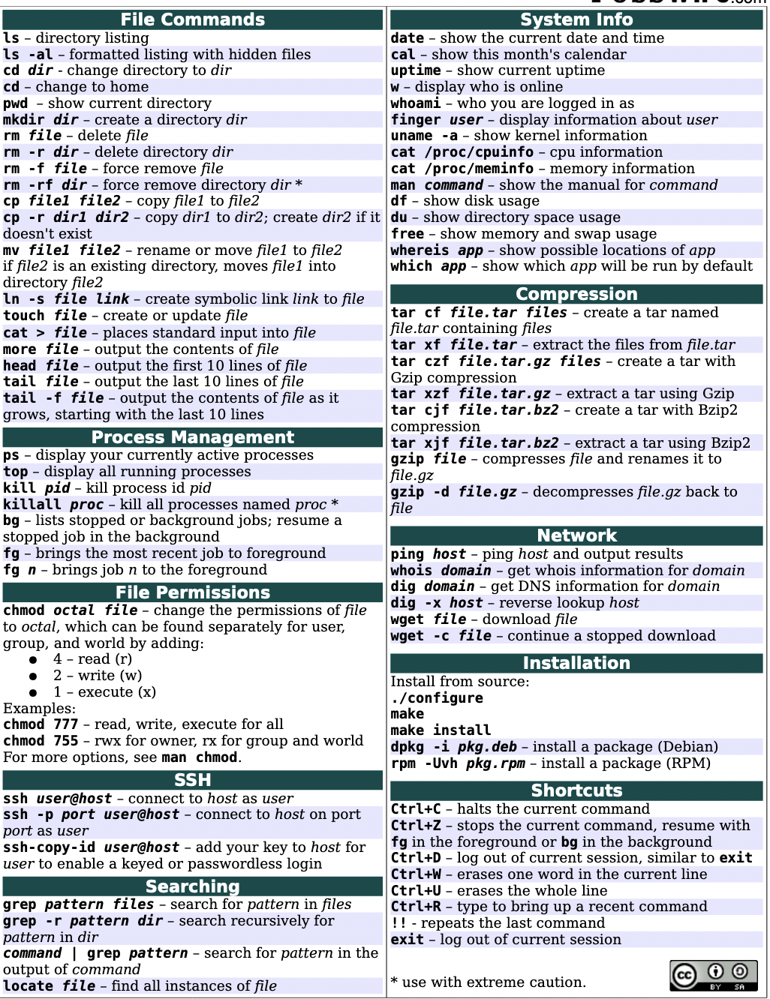

 ## 1.Useful links: 
1. [https://www.cyberciti.biz/faq/linux-ls-command-sort-by-file-size/](https://www.cyberciti.biz/faq/linux-ls-command-sort-by-file-size/)
2. [https://unix.stackexchange.com/questions/53737/how-to-list-all-files-ordered-by-size](https://unix.stackexchange.com/questions/53737/how-to-list-all-files-ordered-by-size)
3. https://www.rapidtables.com/code/linux/ls/ls-s.html

ls -s/-S command in Linux:
- ls -s option flag lists file size.
- ls -S option flag sorts files/directories list by file size.
```bash
ls -s [_options_] [_file_|_dir_]
```

Examples

```bash
ls  
Desktop   Downloads Pictures Templates Videos  
Documents Music     Public   todo.txt

```   
## 2. Vim cheat sheet

## 3. Unix file commands
