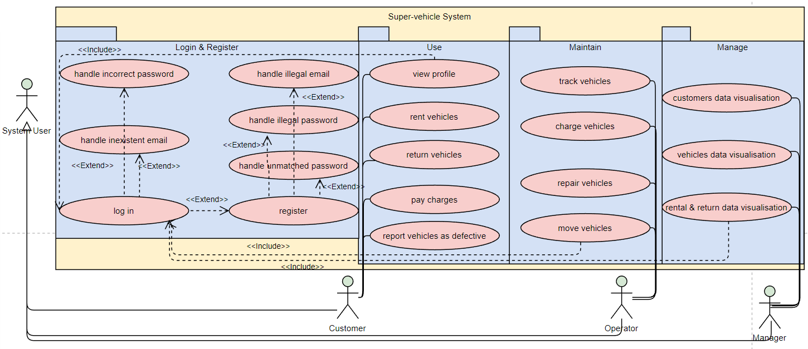
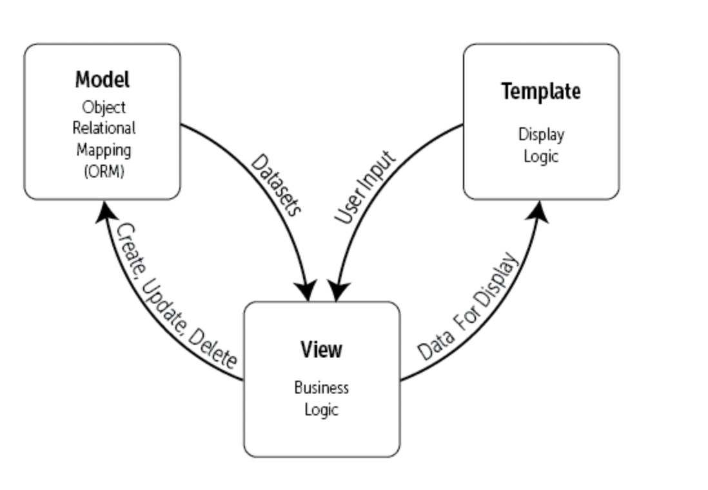

## 1.System Architecture
This system is based on the Django framework to build a web application web page, the main purpose is to build the vehicle rental function. Different users enter the website by logging in, registering and accessing different pages according to the different permissions of their accounts. The functions of the different roles are as follows.

### 1.1customer
Customer is level 0. Once registered on the login page, customers can view information and top up their accounts. Users can also rent vehicle, return vehicle and pay bills, depending on different types of vehicle and the time users rent. In addition, users can give feedback on defective vehicles and report them to the system.
### 1.2operator
The level of operator is 1, who is main responsibility is to manage all vehicle information. Operator can track the movements of all vehicles and charge and repair them, as well as move them to where they should be in order to facilitate vehicle hire. The function of this role is essential for the management of vehicles.
### 1.3manager
The level of manager is 2. Managers  mainly view all the charts drawn from the data obtained from the database, such as user information charts, transport information charts, rent and return vehicle information charts. The database is presented in the form of charts and graphs, which allow managers to analyze the relationships between them and help to optimize and upgrade the system.

## 2.Technology
### 1. Django
Django is an open source framework for web applications written in Python.It is amazingly fast, secure, and exceedingly scalable that allow programmers to achieve most of the functionality on a website with very little code. Therefore, we choose Django as our development framework to build the super-vehicle website.

Django is based on the MTV (Model + Template + View ) model, which is a software architecture pattern in software engineering. Model is responsible for writing the functions that the program should have and for mapping the business objects to the database (ORM). Template can display the page (html) to the user. The main function of View is to take care of the business logic and call Model and Template.

In addition, the analysis of the entire website implementation is as follows. The user initiates a request to our server through the browser, and this request goes to the view function. If no data call is involved, then the view function returns a template directly to the user at this time, i.e. a web page. If data calls are involved, then the view function calls the model, which goes to the database to find the data and then returns it level by level. The view function fills the returned data with spaces in the template and finally returns the web page to the user.
[https://www.djangoproject.com/]
### 2. Sqlite3
SQLite is a software library that implements a free, serverless, self-sufficient, zero-configuration, transactional SQL database engine. Programmers can use simple commands  (CREATE, SELECT, INSERT, UPDATE, DELETE, and DROP) in Sqlite to operate database in Django, which greatly facilitates  operations on the database.
[https://www.sqlite.org/index.html]
### 3. Bootstrap
Bootstrap is a clean, intuitive, and robust front-end development framework that makes web development faster and easier. The style of this project is mainly based on Bootstrap 5.2 and achieves great visual effect.
[https://getbootstrap.com/]
### 4. Pyecharts
Pyecharts is a Python Echarts Plotting Library. It contains more than 30 kinds of charts, integrated with Django and other major Web frameworks. So the project is based on pyecharts to implement visualization functions for the manager to view data. 
[https://pyecharts.org/#/]

## 3.Function
### 3.1 Register & Login

#### a. Register & Login function
Registration is a webpage that provides the user with an email address to obtain an account for the site. Users must provide a username, gender, age, country, email and password to register successfully. 
Once the user has successfully registered, they are redirected to the login page, where they can log in with their email and password. If the user provides the correct user information and password, it is possible to jump different pages depending on the user's level.
#### b. Function Design

When users use the site in the first time, users should provide username, gender, age, country, email and password to register or login the website. 
As the user registers, the email in the account should be unique. The user's password should also be reconfirmed to prevent the user from entering the wrong password. 
While the user login, the formate of email and password should be verified, and filter database to get detail information of the user. And users are grouped into different pages according to different user levels.

#### c. Implementation
1. register

The registration page is written in html and mainly uses bootstrap styles.
The front-end page uses the form, using post requests to submit user information to the back-end.

When the back-end receives data from the front-end, the data is processed to check if them are standardized and use md5  to encrypt passwords.

Second, if the specification is not met, the post request is not allowed and the register page is returned.
Third, if the user enters the data as specified, a request is made to the database as to whether the same email address is available.
And, if the database has information about this email, it means that the user is already registered, so user will not be allowed to register and will return to the register page again.
Last, if the email is unique, the data is created into the database and a real user is generated and jumps to the login page.

2. login 
The login page submits the form with a form that passes the user's email and password to the backend.
When the user information is received by the backend, data verification is performed and the password md5 encryption is processed.

Then  programming filters data of user information of databases, if the information cannot be found and returns an error message.

Final, if the user information is found, which will be stored in session for seven days. And it jumps to different pages according to the level of user role.

### 3.2 Report

#### a. Report Function
The report page is designed to facilitate the reporting of defective vehicles by customers, so that administrators are aware of the status of the vehicle and can maintain it in a timely manner.

#### b.Function Design

When using the car, users will find defects and functional flaws in the vehicle, which can be reported to the system in time for repair.
The user can select the id of the vehicle to feed back content and the information will be collected by the back office and fed back to the management.
#### c. Implementation
The front-end page mainly displays the id of the vehicle to the user, who can identify the vehicle and fill in the information. The page will collect the information and pass it on to the function.
The backend receives the information and modifies the report, repair and vehicle databases. 

### 3.3 Profile
#### a. Profile function
This page is to display user information and top-up accounts.
Users entering the page will see their information, such as name, email, age, gender, country and balance.
Customers can also charge money on this page so that they can hire a vehicle.
#### b.Function Design
When the user enters the page they will see their information displayed, such as name, email, age, gender, country and other personal information.
What's more, the user's account balance can be topped up. The balance will change after they have been filled with value.
#### c. Implementation
The front end page consists of two parts. One is a list to display user information, which is fetched through a for loop and displayed on the front page.
The other part of the form is the form submit, which is used to get the user to recharge the money.

The back-end will provide user information to the front-end and update the userInfo database once the data is received.

### map
#### Map Function
This part is Google Maps and show the user to view the position of the car, so that users can find nearby transport based on their location.

Function Design
map function is the main part of the system. The system introduce Google Maps to display address information, and indicate the current position of the car with different icons for different states of vehicle. Polygons are also used to show the length of the path, displayed on the page.

Implementation

The entire map is made up of front-end html pages, and we use markers to mark vehicles, search bicycle's location by id, draw the route between customer's location to other locations, get users position.

