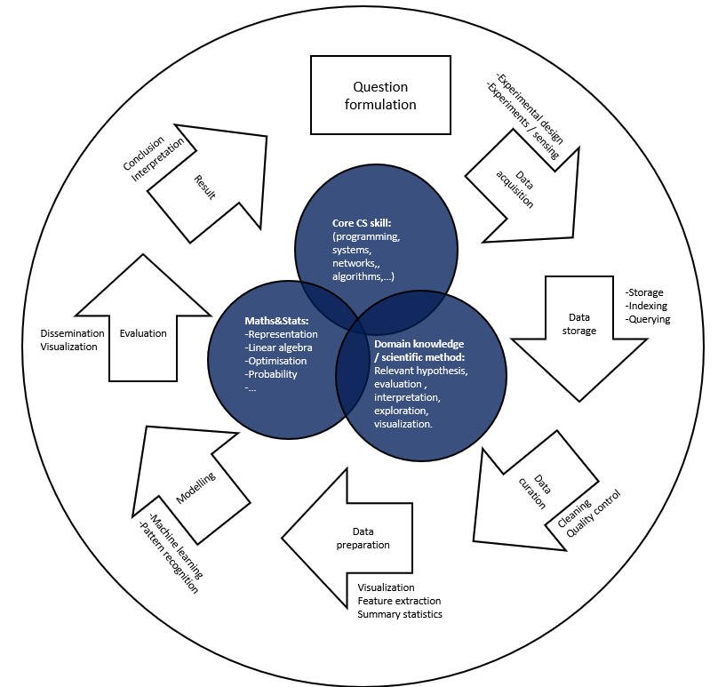

## Data science and systems overview


-   Question formulation
-   Data acquisition
-   Data storage and access
-   Data curation and preparation
    -   Quality control
    -   Curating (/cleaning)
    -   Visualization
-   Basic modeling
-   Evaluation
-   Results & Conclusion

## Structure of IDSS
#### Mathematical foundations using Python:
> -   Vector spaces (data representation)
> -   Computational linear algebra (e.g. PCA/SVD)
> -   Optimisation
> -   Probability (the basics and inference)

#### Data storage:
> Aside from built-in Python packages for handling tabular data, we will be presenting core material on:
> 
> -   (Databases)
> -   Indexing
> -   Querying
#### Other skills
> -   Numpy (in detail) and Pandas (self-study / recommended material)
> -   Visualization
> -   Critical analysis and reflection
> -   Practical with a real-world data science case

## Example
参考资料💾：[http://www.textbook.ds100.org/intro.html](http://www.textbook.ds100.org/intro.html)

### 安装文件
```python
import pandas as pd
import numpy as np
import matplotlib.pyplot as plt
import seaborn as sns 

import plotly.offline as py
py.init_notebook_mode()
import plotly.graph_objs as go
import plotly.figure_factory as ff
import plotly.express as px
```
#### Seaborn:基于matplotlib 更高级API封装
官方文档：[http://seaborn.pydata.org/api.html](http://seaborn.pydata.org/api.html)

CSDN：[https://blog.csdn.net/qq_41185868/article/details/80217906](https://blog.csdn.net/qq_41185868/article/details/80217906)

安装：`pip install seanborn`

#### Plotly：绘图基础库

官方文档：[https://plotly.com/python/](https://plotly.com/python/)

CSDN：[https://blog.csdn.net/zhouchen1998/article/details/108976110](https://blog.csdn.net/zhouchen1998/article/details/108976110)

安装：`pip install plotly`

### 1.The questions
### 2. Data acquisition and availability
### 3.Storage and access
### 4. Data exploration, preparation and curation (数据挖掘、准备和策划)
#### 4.1loading and inspecting the data using Pandas
Pandas官网：[https://pandas.pydata.org/](https://pandas.pydata.org/)
```python
data = pd.read_csv("roster_mod_20202021c.csv")
len(data)  # 374
data.head(20)
data['Firstname'].unique()
len(data['Firstname'].unique()) # 349
```
#### 4.2curation and cleaning
```python
data['Firstname'] = data['Firstname'].str.lower()

(data['Firstname'].str.low()
	.value_counts().sort_values(ascending = False) 
	.head(5).plot(kind = 'barh', title = 'Firstname') # barh 二维水平直方图
	)
```
#### 4.3Basic visualization and summarization
```python
data.describe()
```
### 5.Data modeling and analysis
```python
sns.distplot(data['Firstname'].str.len(), rug=True, 
			 axlabel="Number of Characters");
```
### 6.Evaluation

## 资料💾
-   [NumPy user guide](https://docs.scipy.org/doc/numpy-1.13.0/user/basics.html)
-   [NumPy API reference](https://docs.scipy.org/doc/numpy-1.13.0/reference/)
-   JR Johansson's scientific python notes: [JRJohansson](https://github.com/jrjohansson/scientific-python-lectures)
-   Scientific packages are well covered in this article: [SciPy lectures](https://scipy-lectures.github.io/)
-   A useful [Stanford course](http://web.stanford.edu/~arbenson/cme193.html) on scientific python
-  [NumPy cheatsheet](https://github.com/juliangaal/python-cheat-sheet/blob/master/NumPy/NumPy.md)
-   [NumPy user guide](https://docs.scipy.org/doc/numpy-1.13.0/user/basics.html)