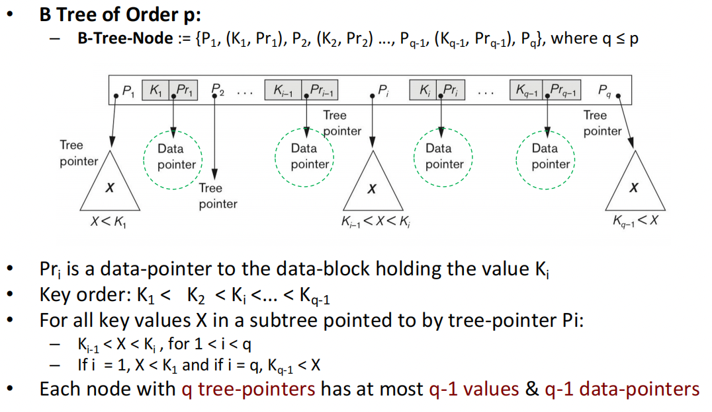

Recommended Textbooks:

- H. Garcia-Molina, J.D. Ullman and J. Widom. “Database Systems: The Complete Book”. Pearson Education Ltd, 2014.
- Online access via UoG Library: http://tinyurl.com/ybsbthan
- M. Kleppmann. Designing data-intensive applications: The big ideas behind reliable, scalable, and maintainable systems. O’Reilly, 2017.
---
## 1. Physical storage
### 1.1 Data system
1. Store data: (where ? how ? For how long? Guarantees?)
2. Answer queries: (quickly, Accurately, Necessary components)
3. Physical Storage Hierachy

4. 3-level storage hierarchy: (Primary storage, Secondary storage, Tertiary storage 第三存储)
### 1.2 Physical storage
#### Disk anatomy & I/O Access

#### Fixed- vs variable-length records

#### Blocking Factor 块因子 bfr
1. blocks -> fixed-length (512 bytes to 4k bytes)
2. bfr :  the number of records stored in a block
3. 
## 2.  File structure 
### 2.1 Heap files 
1. Insert : O(1)
2. Retrieve 检索 : O(b)
3. Delete：O(b)+1
### 2.2 Sequential files : Ordered Files
1. Retrieve: O(log2b)
2. Insert: expensive, find and other need move, (chain points need update)
3. Delete: Expensive 
4. Update: O(log2b)+O(1)
###  2.3Hash files

、
### 2.4 Indexes
#### (1)1-d space ✨
| Index            | types                  |Details|
| ---------------- | ---------------------- |---------------------- |
| Primary Index    | ordering-key           |pair{k,p}|
| Clustering Index | non-key field of a seq |  |
| Secondary Index                 |    non-ordering                    | |

#### (2) Multilevel Index

#### (3) Tree

#### (4) B-Tree (这个内容比较多)

