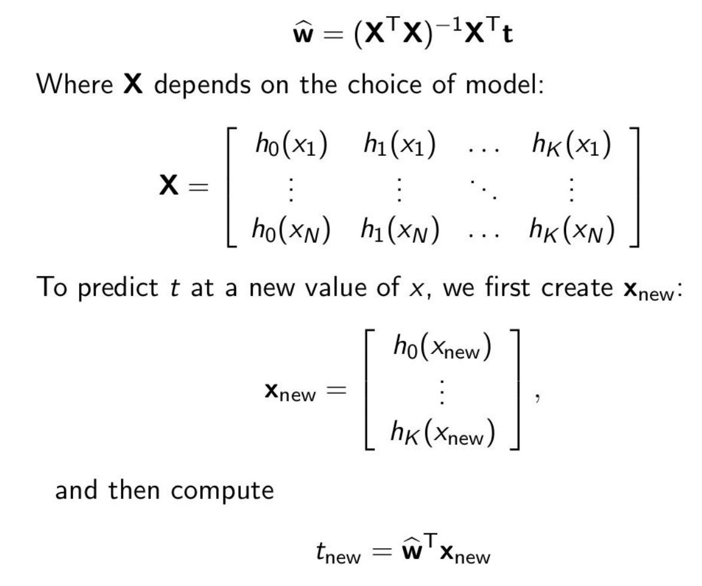

## Regression(回归)
## 1. Linear regression（线性回归）
### 1.1Variables
Olympic : X

Winning time: Y
### 1.2Modle
t = f(x)
### 1.3Data (training data)
- N attribute-response pairs, (Xn, tn)
- e.g. (1896,12s), (1900, 11s), . .., (2008, 9.69s)
- X1 = 1896, t1 = 12, etc
### 1.4 Linear Model
t = f (x) = w0 + w1x = f(x;,w0,w1)
#### a. W_0, W_1 (best)
#### b.Loss function

#### c. Squared Loss

#### e.Average Squared loss

#### f. argmin L

#### g.Gradient Descent(梯度下降)

#### h.supplementary

## 2.Polynomial regression(多项式回归)
### 2.1 Polynomial

### 2.2 Vector form (still a linear regression)

### 2.3 Minimizing the loss

### 2.4 General Linear Regression

### 2.5 Generalization and over-fitting   泛化和过度学习
Nosie :噪音
### 2.6 Cross-validation(CV) 交叉验证
repeat to make results more accurate
1. 5-fold CV
2. 10-fold CV 
3. Leave-one-out CV (LOOCV) 留一法

### 2.5 Common function

##  3.Bayesian linear regression (贝叶斯线性回归)
### 3.1 Bayes rule

### 3.2 compute

### 3.3 likelihood, posterior, and data (可能性，后验和数据)
