## 1. Basic, features, dimensionality reduction
### 1.1 classification 
automatically label data (自动标签数据)
ML paradigms(案例)
1. Supervised - need labled training data
	1. Observe - x, y
	2. Model - relationship 
	3. Predict -  new data
2. Semi-supervised -  some labled training data
3. Unsupervised /Self-supervised - no labled training data
### 1.2 Classification vs Regression
| classification     | Regression       |
| ------------------ | ---------------- |
| discrete           | continuous       |
| y:image, dog, cat, | predict of price |
| classes⬆️，difficulty ⬆️                  |                  |
### 1.3 Components
1. labeled
2. features
3. model
4. evaluate
### 1.4 System

### 1.5 Features Selection
1. high dimensional features (高维特征)
2. not all features
3. reduce feature space by throwing out unimportant
### 1.6 PCA (Principal Component Analysis)
account for the highest variance
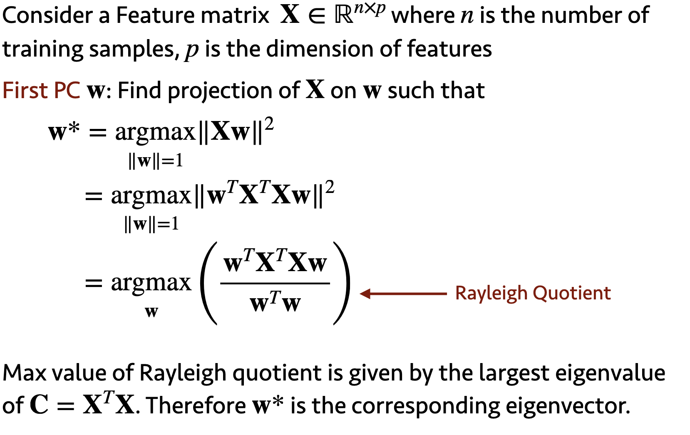
1. just a linear transformation 
2. not change any information
### 1.7 Dimensionality reduction via PCA
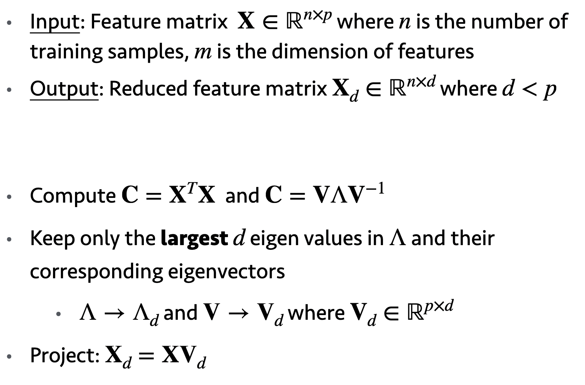
## 2. Models
### 2.1 K-NN
### 2.2 Logistic regression
### 2.3 SVM
1. find a hyperplane 超平面(decision boundary)
2. hyperplane should maximize the distance from data points of either classes
#### (1) W & b
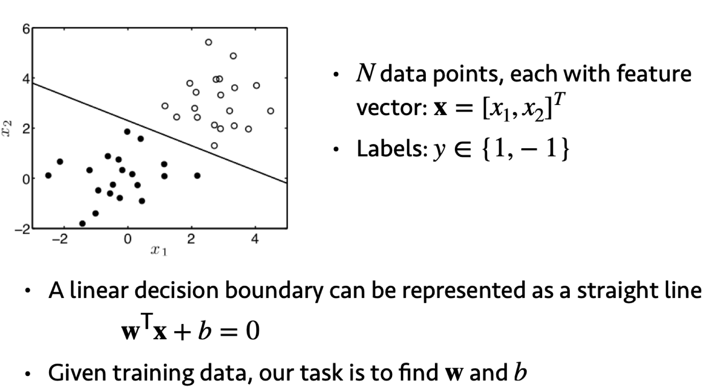
#### (2)classification
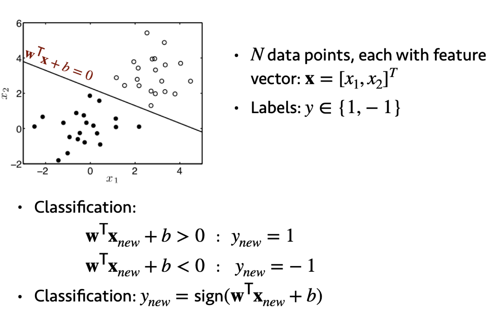
#### (3) Separating classes
Maximizes the margin of classifier (分类器)
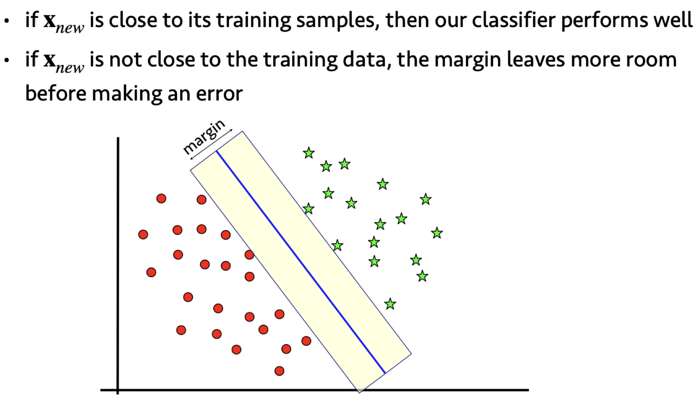
#### (4) W 
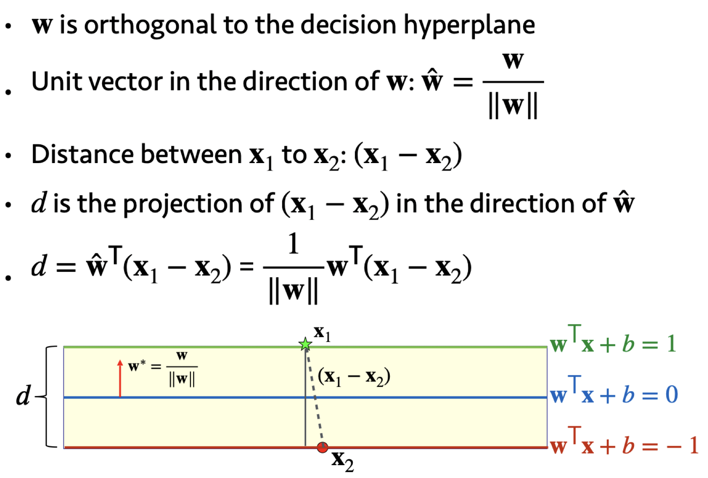
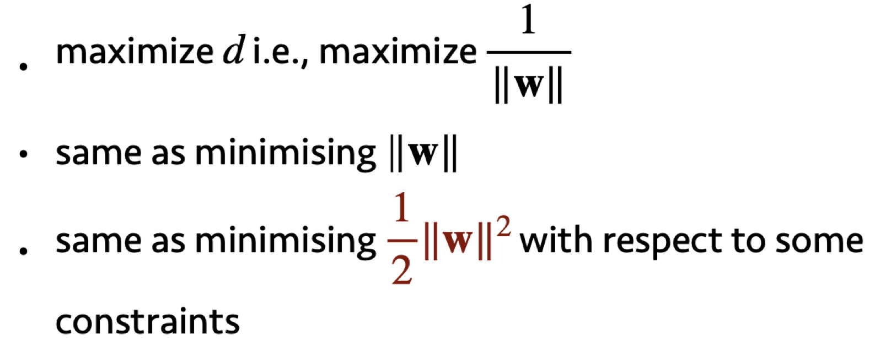
#### (5) minimizing
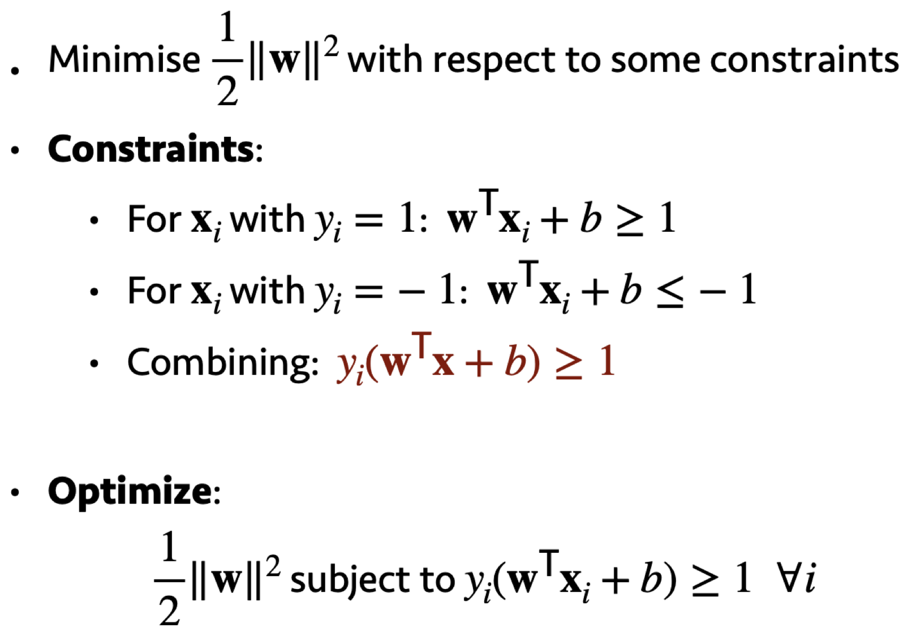
#### (6) SVM Loss
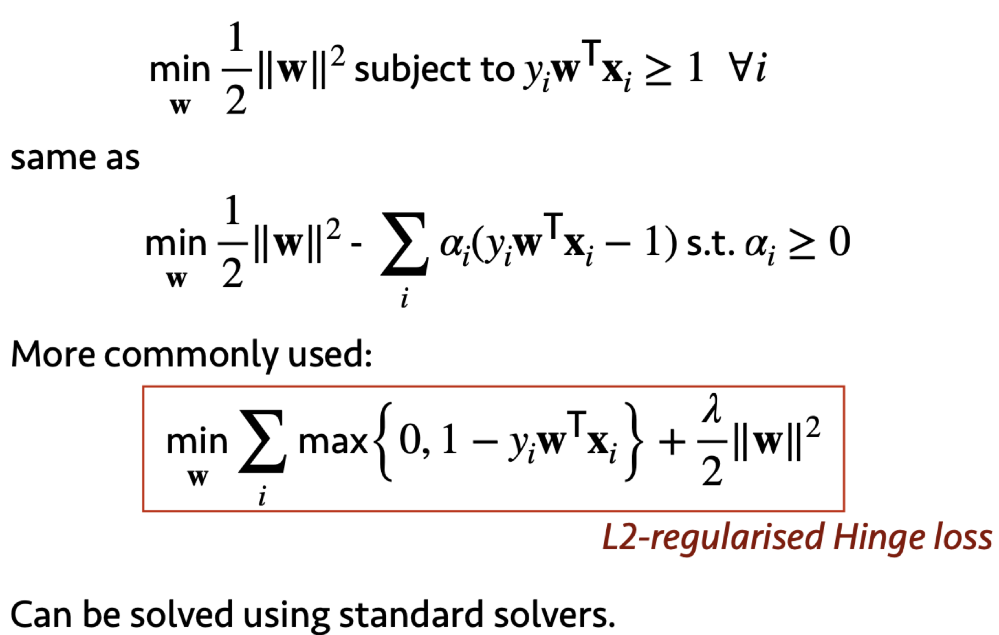

#### (7)Support vector 支持向量
1. prediction of hyperplane depends on a small number of data points -- support vectors
2. constraints we used - create hard margin

#### (8) Kernel trick 核函数
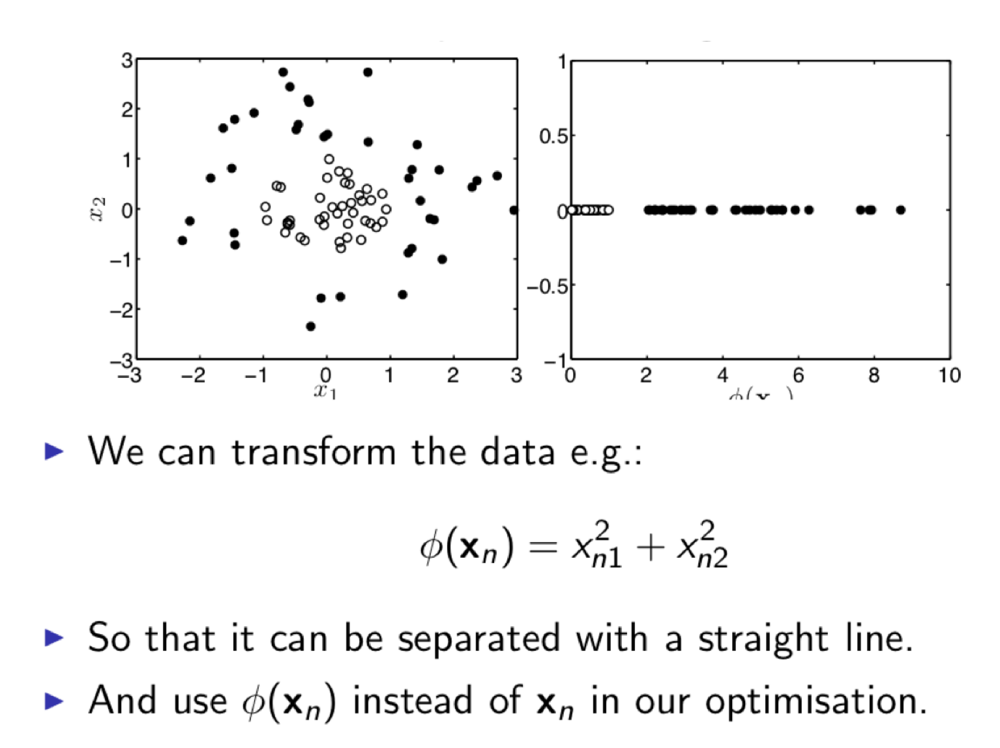

#### (9)Multiclass SVM
1. Train a binary classifier (二元分类器) :positive & negative
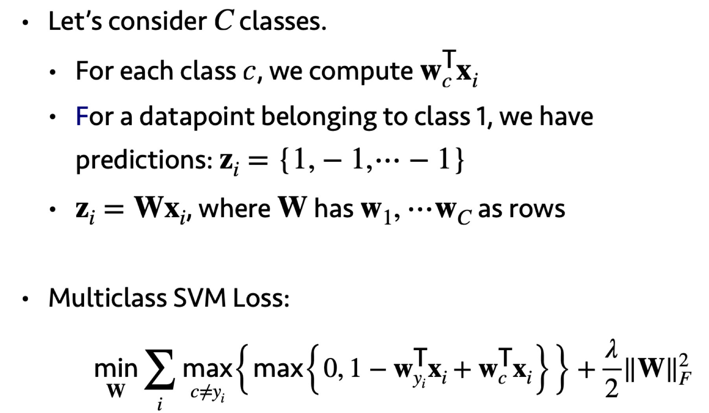
## 3. Evaluation
