## 1. Basic, features, dimensionality reduction
### 1.1 classification 
automatically label data (自动标签数据)
ML paradigms(案例)
1. Supervised - need label training data
	1. Observe - x, y
	2. Model - relationship 
	3. Predict -  new data
2. Semi-supervised -  some label training data
3. Unsupervised /Self-supervised - no label training data
### 1.2 Classification vs Regression
| classification     | Regression       |
| ------------------ | ---------------- |
| discrete           | continuous       |
| y:image, dog, cat, | predict of price |
| classes⬆️，difficulty ⬆️                  |                  |
### 1.3 Components
1. labeled
2. features
3. model
4. evaluate
### 1.4 System
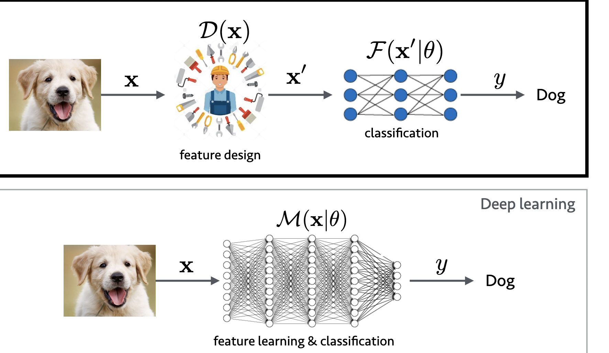
### 1.5 Features Selection
1. high dimensional features (高维特征)
2. not all features
3. reduce feature space by throwing out unimportant
### 1.6 PCA (Principal Component Analysis)
account for the highest variance

1. just a linear transformation 
2. not change any information
### 1.7 Dimensionality reduction via PCA

### 1.8 Performance evaluation
#### (1) 0/1 loss
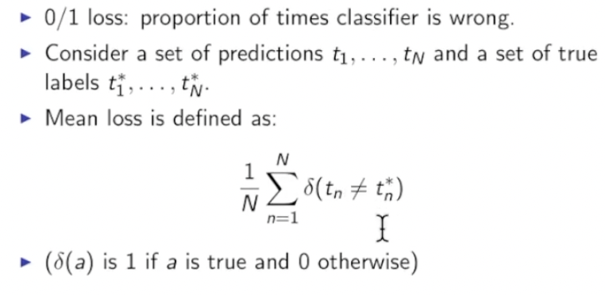
| quantities | detail         |
| ---------- | -------------- |
| TP         | true positive  |
| TN         | true negatives |
| FP         | false positive |
| FN           |     false negative           |
##### Sensitivity
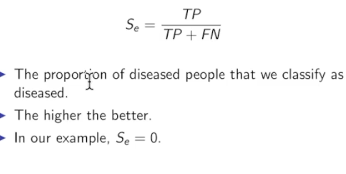
##### Specificity
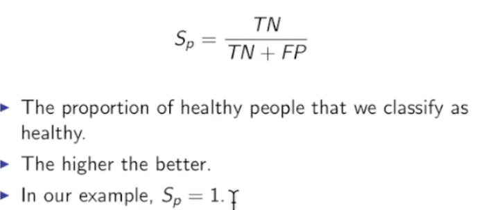

#### (2)ROC  (Receiver Operating Characteristic)
d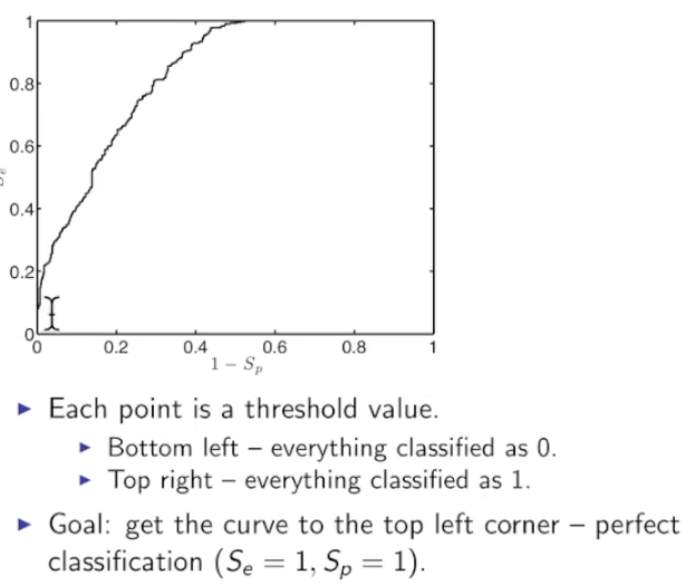
##### AUC 
#### (3) confusion matrices
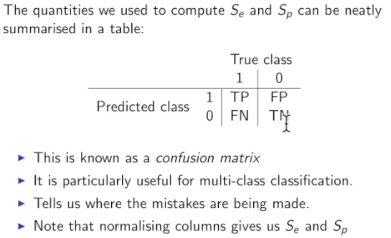
## 2. Models
### 2.1 KNN
No-probabilities; can do binary or multi-classes; no training phase; fast
#### (1)Works
1. Choose k
2. Find a test object X_new;
3. Find the k closest points from the training set.
4. Find majority class of these  K neighbors
#### (2) Class imbalance
1. As k increase, small classes will disappear
2. K >= 11, class 2 will always win.
### 2.2 Bayes classifier
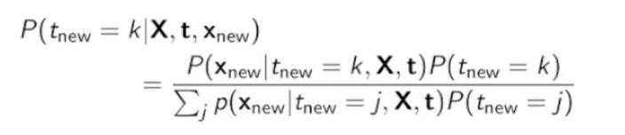

#### (1) likelihood
1. D-dimensional vector -- Gaussian likelihood
2. N coin tosses -- Binomial likelihood
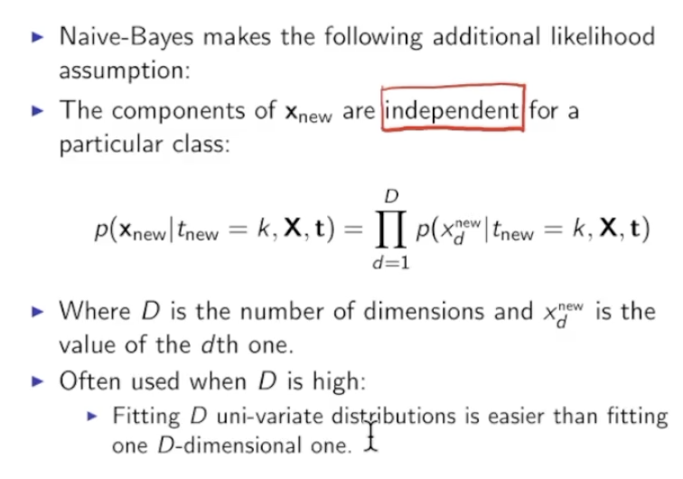
#### (2)  D-dimensional vector
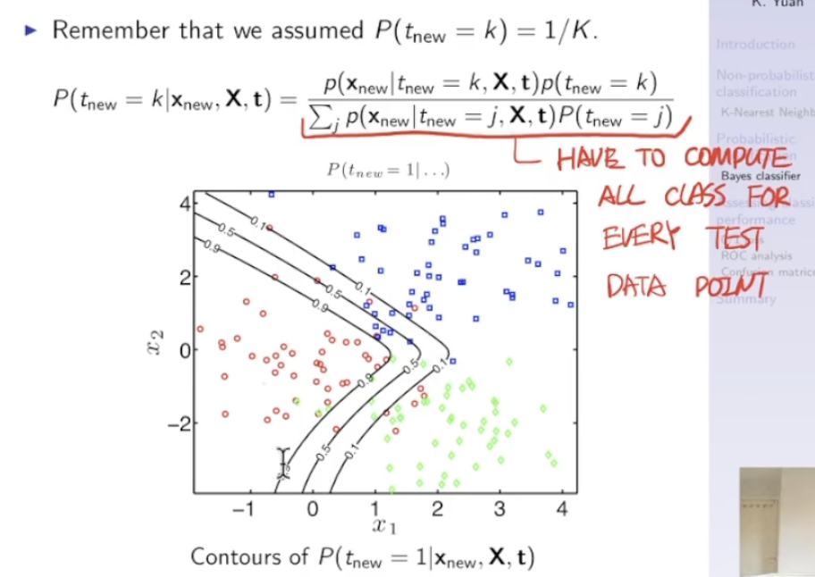

#### (3) N coin tosses
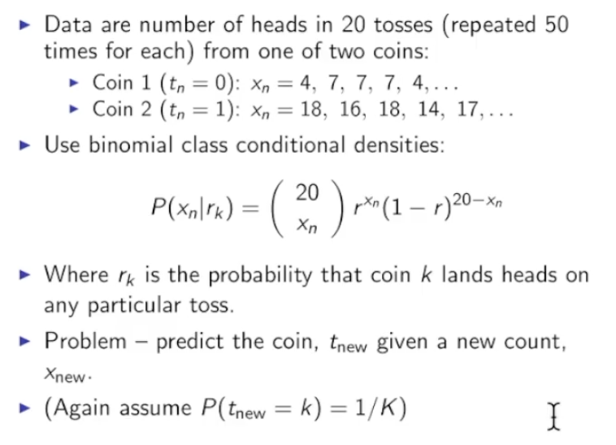

### 2.3 Logistic regression 逻辑回归
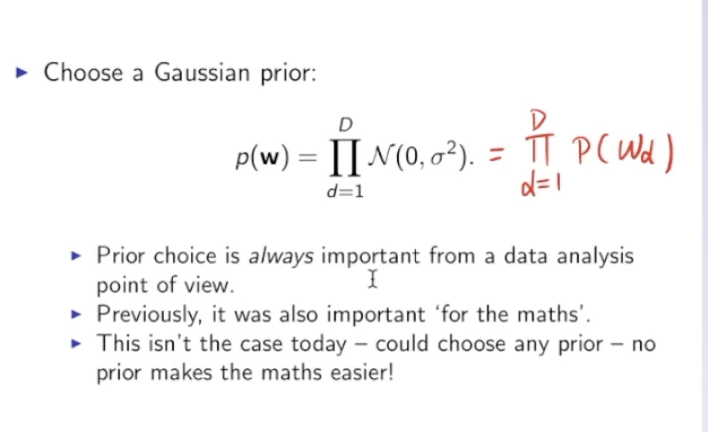
#### (1)compute
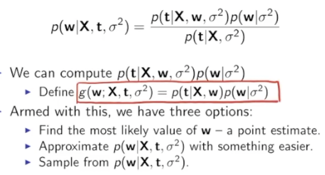
#### (2) MAP (maximum a posteriori)estimate
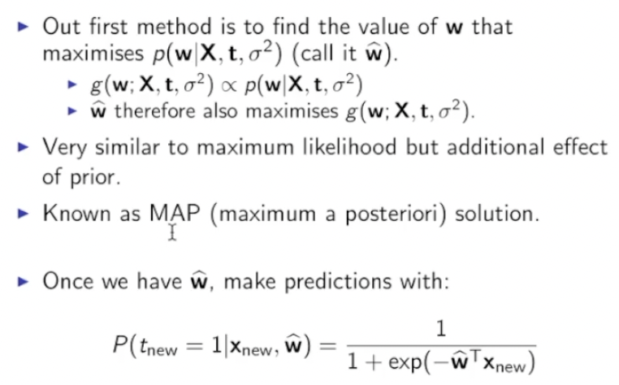
#### (3) Decision boundary
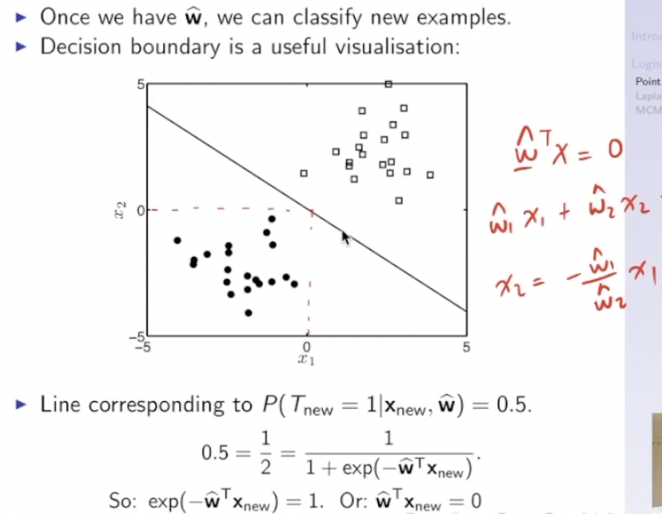
### 2.3 SVM
1. find a hyperplane 超平面(decision boundary)
2. hyperplane should maximize the distance from data points of either classes
#### (1) W & b

#### (2)classification

#### (3) Separating classes
Maximizes the margin of classifier (分类器)

#### (4) W 

#### (5) minimizing

#### (6) SVM Loss

#### (7)Support vector 支持向量
1. prediction of hyperplane depends on a small number of data points -- support vectors
2. constraints we used - create hard margin

#### (8) Kernel trick 核函数

#### (9)Multiclass SVM
1. Train a binary classifier (二元分类器) :positive & negative

