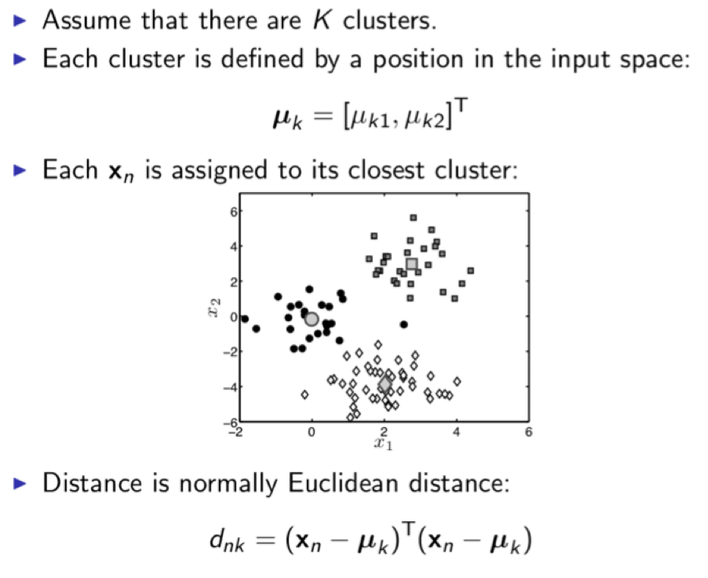
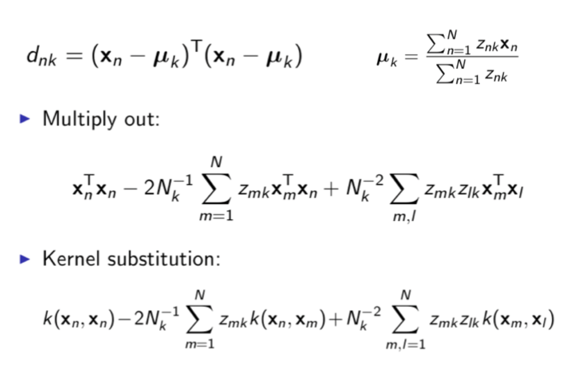
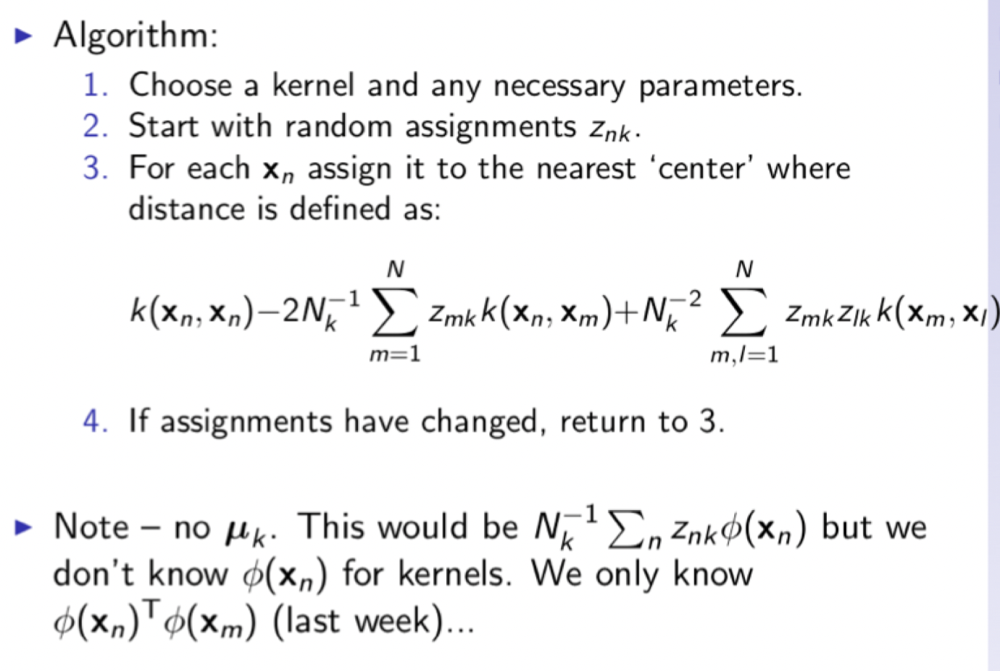

## Clustering 聚集
## 1. Clustering
## 2. K-means
### 2.1 Steps
1. choose number of clusters
2. select k random points as centroids(形心)
3. estimate the distance between each centroid and each points
4. assign all the points to the closest cluster
5. recompute the centroids of newly formed clusters & repeat 3,4
### 2.2 K clusters

### 2.3 k-means

### 2.4 Algorithm

### 2.5 kernels

## 3. Mixture models