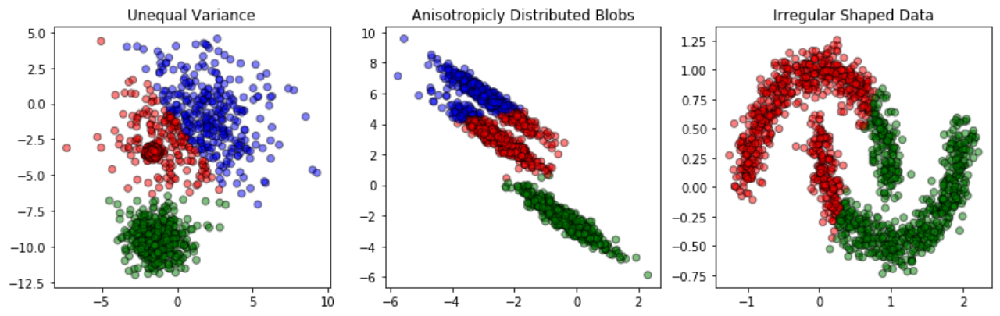
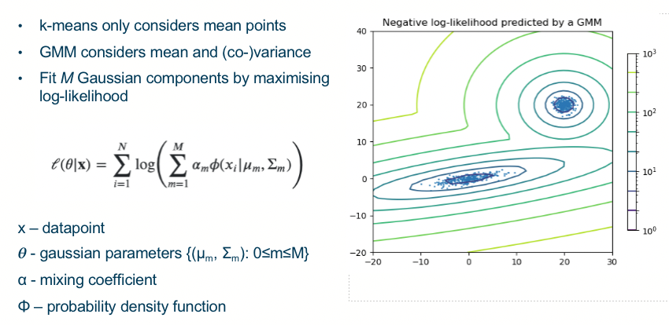
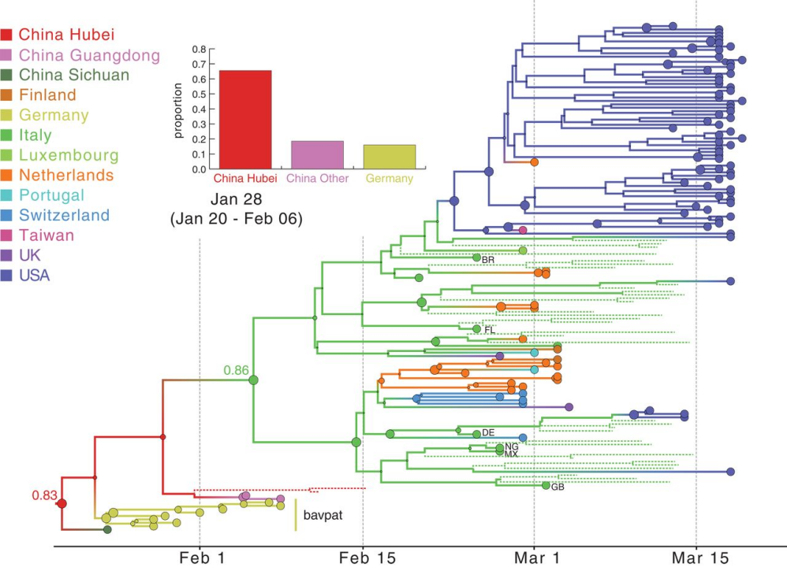
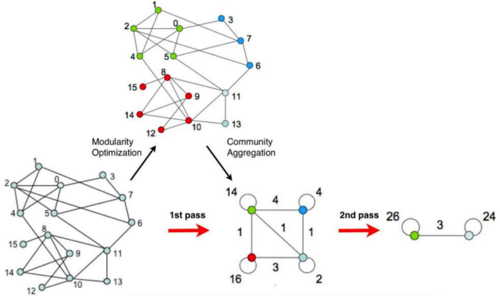
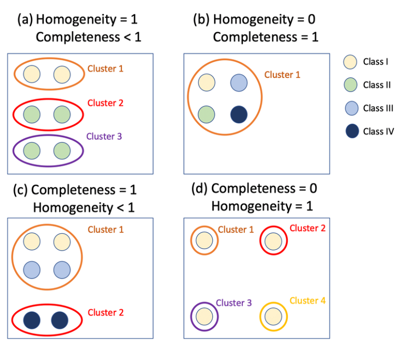
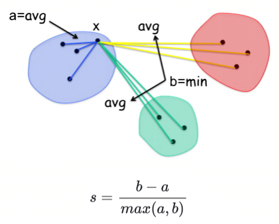

## 1.Model Selection for clustering
- Group similar objects together
- Constraints on clusters
- Understand the structure of a dataset
### 1.1 K-means :mean
1. Choose k random points
2. Partition objects into k subset
3. Compute the new centroids (mean points) of the clusters
4. Repeat steps 2+3 until convergence

 各向异性分布的斑点
### 1.2 Gaussian Mixture Model (GMM) : mean + cov

### 1.3 Hierarchical clustering 层次聚类
- Each data point as separate cluster. 
- Consecutively merge clusters until all clusters are connected or specified number of clusters are obtained.

### 1.4 Louvain Clustering 
- Each data point represented as a node 
- Similarity between two data points represented by an edge
- Assign nodes to different clusters by Modularity
- Clusters repeatedly combined until no improvement in modularity

## 2. Measures
### 2.1 V-measure
1. 同质性:每个簇只包含单个类的成员
2. 完整性:给定类的成员被分配到同一个簇

### 2.2 Silhouette Score 轮廓分数
-1: incorrect clustering
≈0: overlapping clusters.
+1: highly dense clustering 

