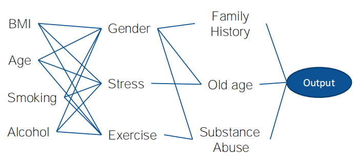
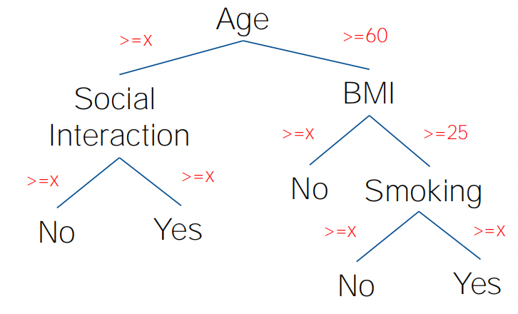
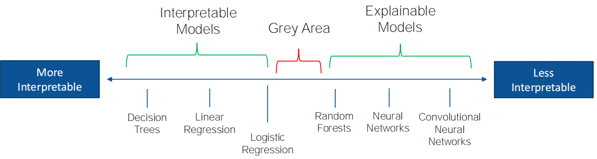
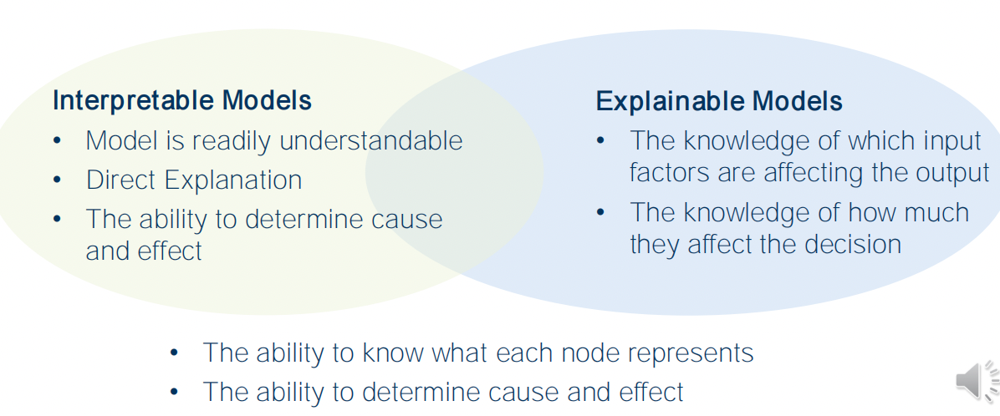

## 1.Explainable Machine Learning Model
### 1. 1 Explainable Model – Representation Learning  可解释模型-表示学习
- Knowledge of the what each node represents
- Latent factors that affect the decision process
- How important each node is to the model’s performance

### 1.2 Interpretable Model -Decision Trees  可解释模型- 决策树
- It is clearly what each node represents
- Easy to visualize and overview the whole decision operation
- Easy to explain to non-specialists
- Results can be tracked and associated with the output of each node

### 1.3 Interpretable vs Explainable Models

### reference
- Arrieta et al. ‘Explainable Artificial Intelligence (XAI): Concepts, taxonomies, opportunities and challenges toward responsible AI’, Information Fusion, 2020. 
- Molnar ‘Interpretable Machine Learning - A Guide for Making Black Box Models Explainable’ https://christophm.github.io/interpretable-ml-book/
## 2.Feature Ranking as Model Agnostic Explanations: Permutation Feature Importance 特征排序作为模型不可知的解释:排列特征重要性
Taxonomy 
- Local vs Global Explanations 
- Model Agnostic vs Model Specific Explanations 
- Data Modality Specific vs Data Modality Agnostic 
- Ad-Hoc vs Post-Hoc Explanations
分类
•局部解释vs全局解释
•模型不可知vs特定于模型的解释
• 数据模态特定vs数据模态不可知
• 即时性和事后性解释

## 3. Preprocessing of ECG Signal 心电信号预处理
## 4. Explainability Use-Case 用例
## 5.Local Interpretable Model -Agnostic Explanations(LIME) 局部可解释模型-不可知解释(LIME)
## 6. Shapley Additive Explanations 沙普利加性解释

