 ## 1.特征缩放
 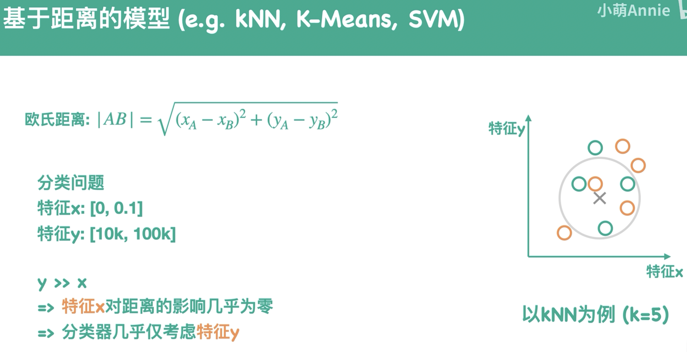

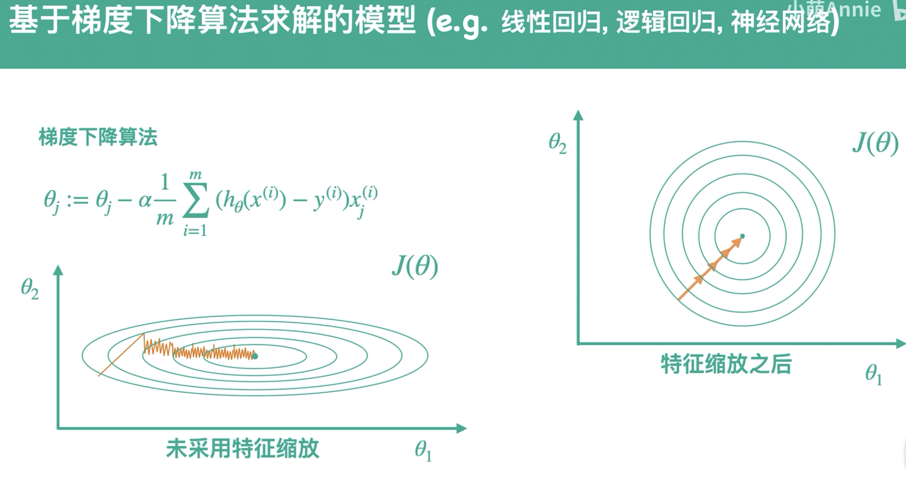

 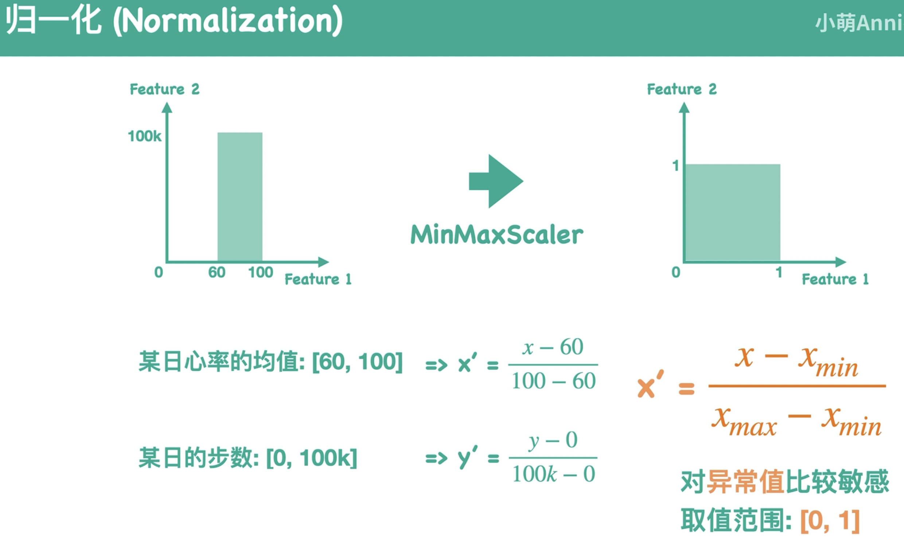
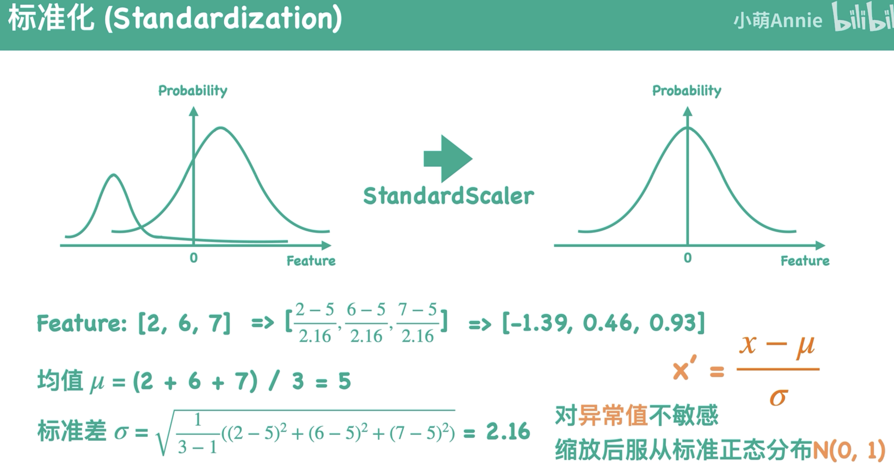
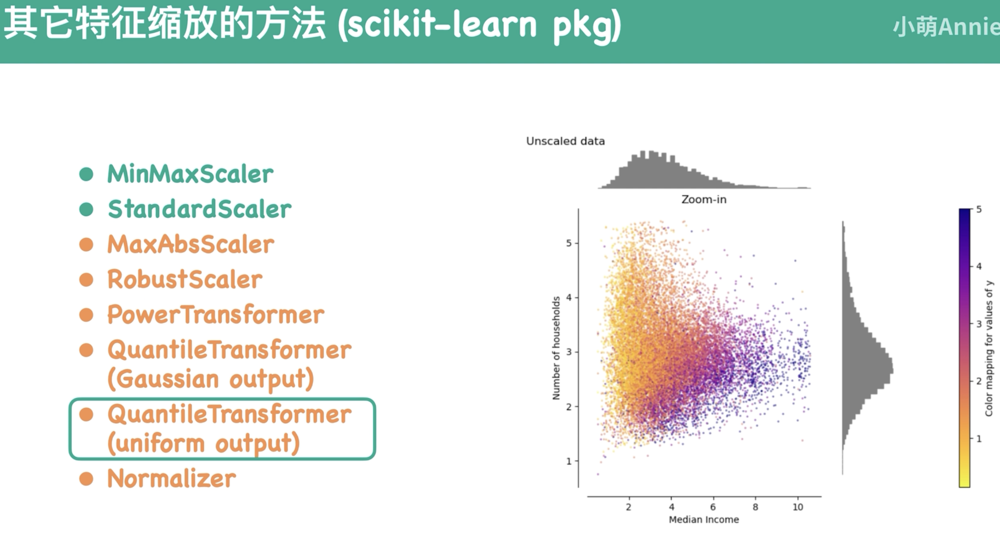

## 2. ROC
 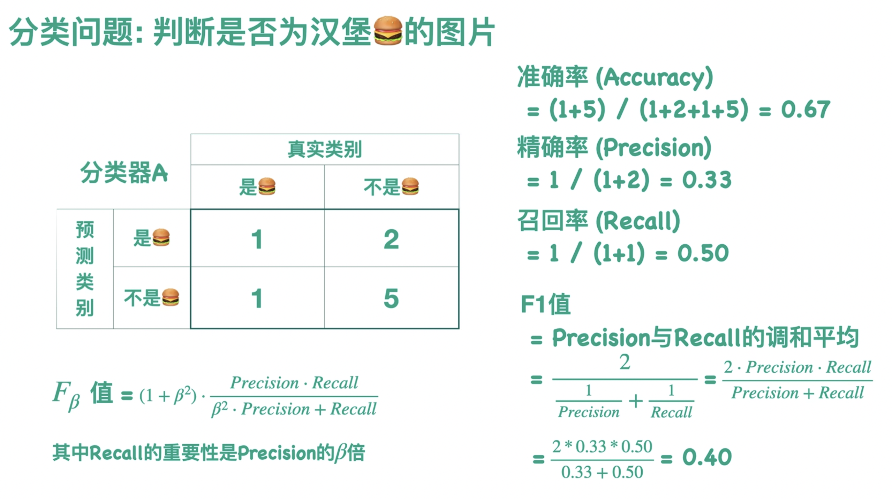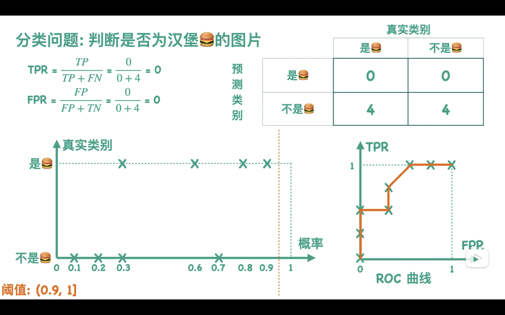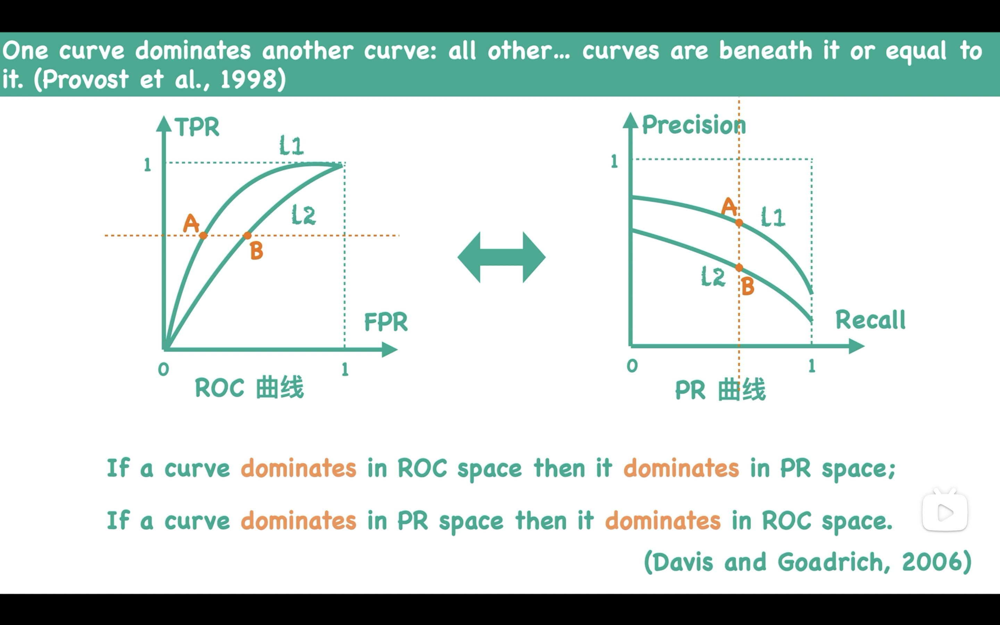
 ## 3. 训练集，测试集，验证集
 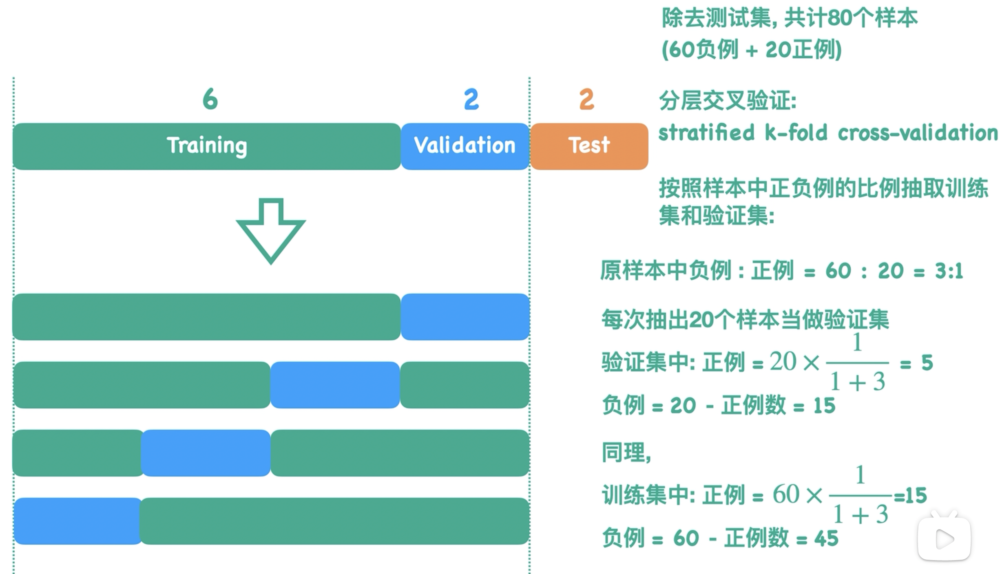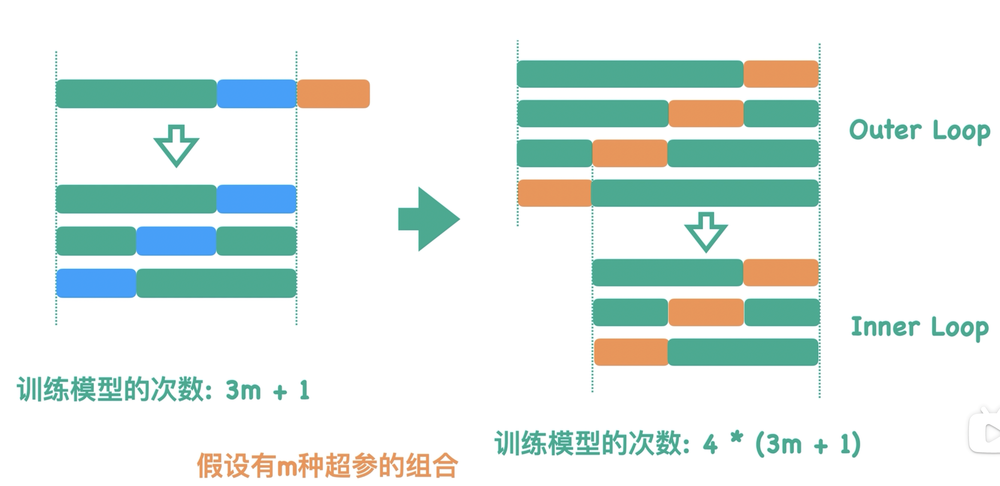
 ## 4. 概率校准
 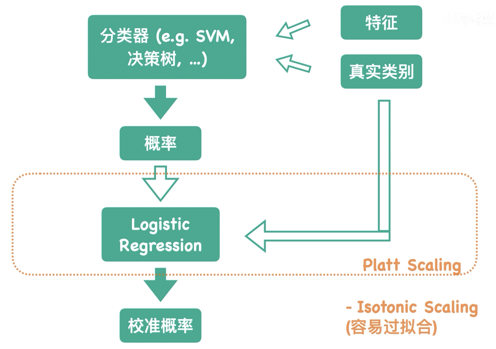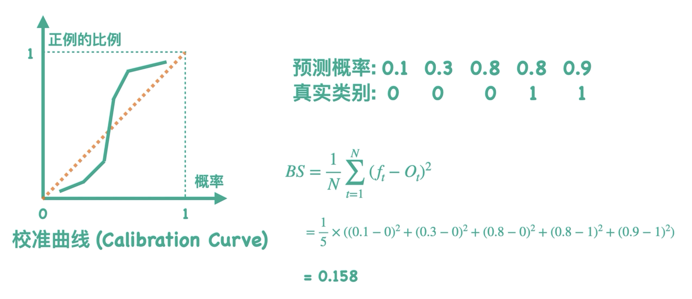
 ## 5. SVM
 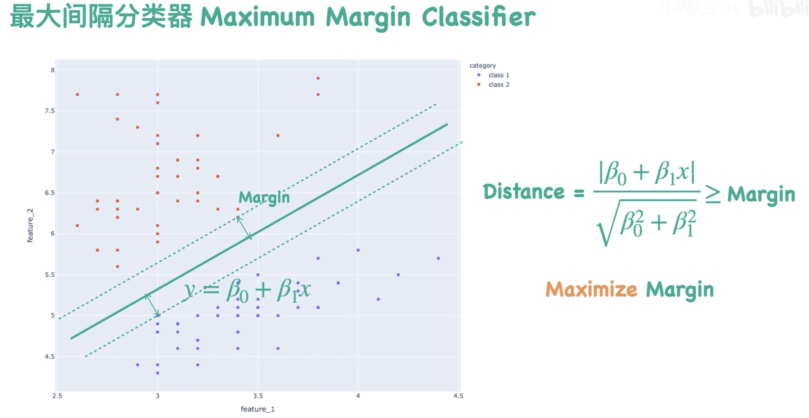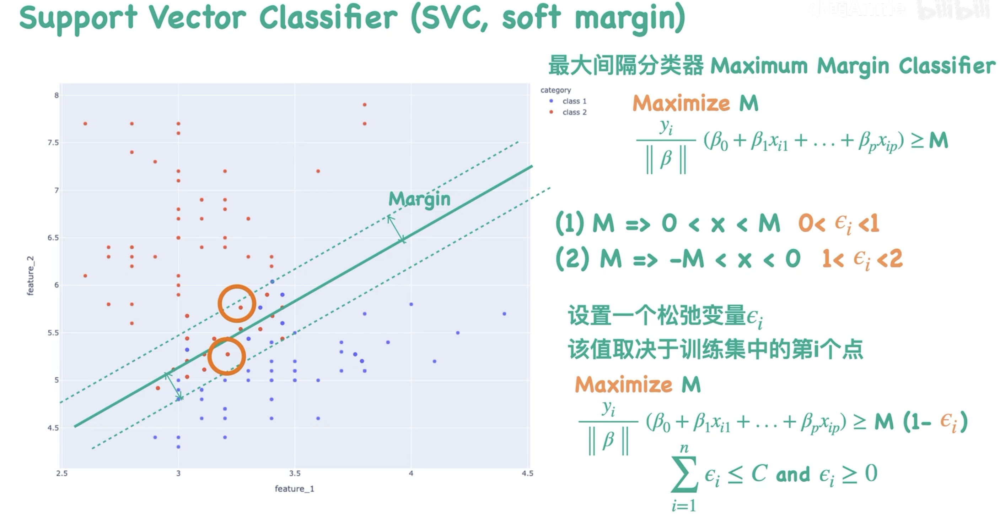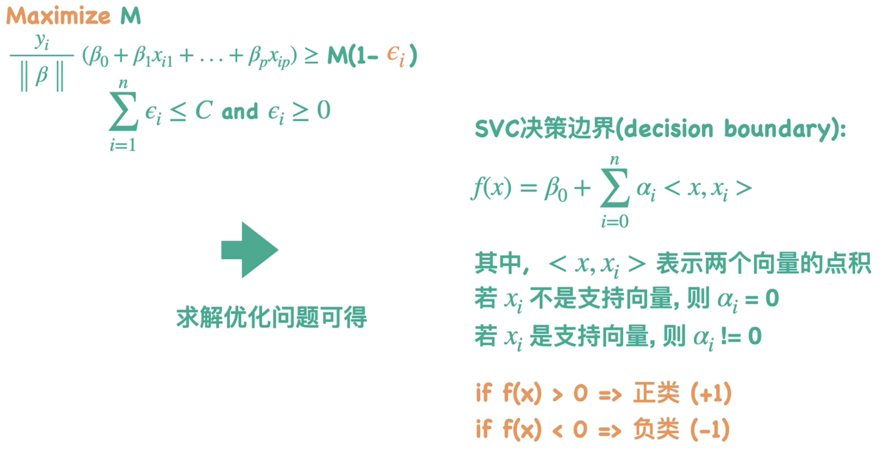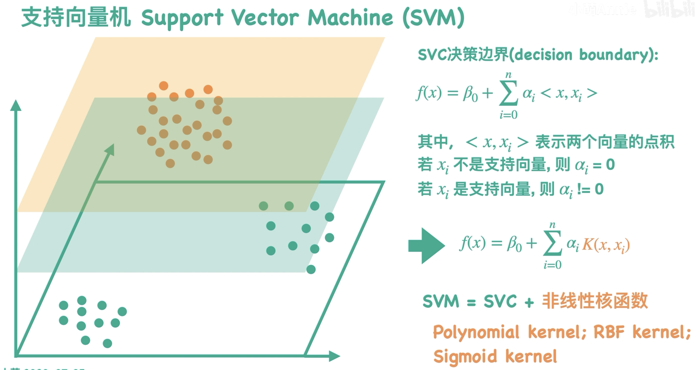
 ## 1. Regression
1. poly:[https://blog.51cto.com/u_7784550/5718020](https://blog.51cto.com/u_7784550/5718020)
3. Ridge, Lasso:[https://blog.csdn.net/arlionn/article/details/85673514](https://blog.csdn.net/arlionn/article/details/85673514)
4. 7种回归：[https://www.cnblogs.com/sumuncle/p/5647722.html](https://www.cnblogs.com/sumuncle/p/5647722.html)
5. 交叉验证：[https://zhuanlan.zhihu.com/p/473281418](https://zhuanlan.zhihu.com/p/473281418)
6. 逻辑回归：[https://blog.csdn.net/weixin_60737527/article/details/124141293](https://blog.csdn.net/weixin_60737527/article/details/124141293)
## 2. Classification
1. ROC:[https://www.zhihu.com/question/23700474/answer/1878757572](https://www.zhihu.com/question/23700474/answer/1878757572)
2. ROC& AUC:[https://blog.csdn.net/qq_40728667/article/details/123119335](https://blog.csdn.net/qq_40728667/article/details/123119335)
3. feature selection: [https://blog.csdn.net/qq_33876194/article/details/88403394](https://blog.csdn.net/qq_33876194/article/details/88403394)
4. PAC:[https://zhuanlan.zhihu.com/p/77151308?utm_medium=social&utm_oi=959071710360649728](https://zhuanlan.zhihu.com/p/77151308?utm_medium=social&utm_oi=959071710360649728)
5. 核函数：[https://blog.csdn.net/mengjizhiyou/article/details/103437423](https://blog.csdn.net/mengjizhiyou/article/details/103437423)
6. 张卷积：[https://onedrive.live.com/redir?resid=D9FB6F451A90788%211906&authkey=%21AGdVGGEpW3KKJzQ&page=View&wd=target%285100%20ML%20for%20DS.one%7Cec531f7a-082d-46ab-8896-50bd37495899%2FLab01%20%E6%80%BB%E7%BB%93%E5%92%8CBUG%E8%AE%B0%E5%BD%95%7Cb332530b-5d14-4aab-8a13-2b31e7e4928a%2F%29&wdorigin=NavigationUrl](https://onedrive.live.com/redir?resid=D9FB6F451A90788%211906&authkey=%21AGdVGGEpW3KKJzQ&page=View&wd=target%285100%20ML%20for%20DS.one%7Cec531f7a-082d-46ab-8896-50bd37495899%2FLab01%20%E6%80%BB%E7%BB%93%E5%92%8CBUG%E8%AE%B0%E5%BD%95%7Cb332530b-5d14-4aab-8a13-2b31e7e4928a%2F%29&wdorigin=NavigationUrl)