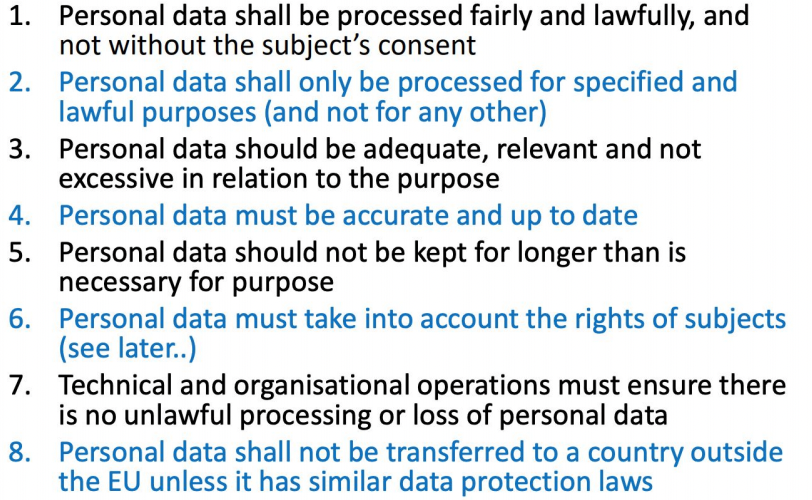
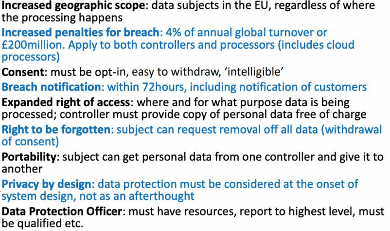
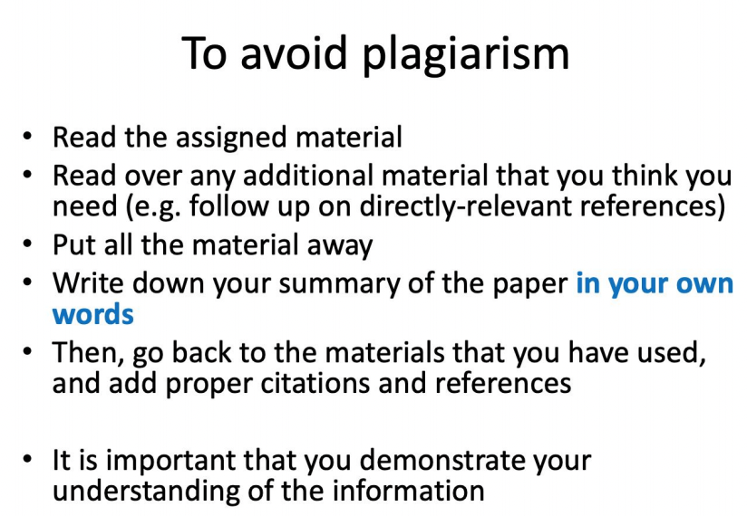

## 1.Copyright
### 1.1 Theft
1. Tangible theft
2. Intangible theft
3. Theft Act 1968
	1. depriving from others 
	2. things in action and other intangible property
	3. if his intention is to treat the thing as his own
### 1.2 Copyright design and Patents Act
1. property right 产权: right to own the property
- original literary, dramatic, musical or artistic works,
>  literary work:
>  a) a table or compilation other than a database
>  b) a computer program
>  c) preparatory design material for a computer program
>  d) a database
- sound recordings, films or broadcasts
- the typographical arrangement of published editions
2. recorded
3. the work is recorded by the permission of the author
#### Databases
1. collection of works:  arrange in systemic or methodical way 
 +individually accessible
 2. original :own intellectual creation
 3. substantial investment
### 1.3 Copyright
owner: make copies, give copies, make changes
#### copyright infringement 版权侵犯
1. primary: against the copyright holder
2. secondary: commercial gain
#### Don't own the copyright
1. make a backup that you are authorized
2. decompile a program
#### Don't want copyright
1. public domain
2. GNU licences
## 2. Confidential Information 信息机密
### 2.1 The Law of confidential information
- Designed to prevent someone revealing泄漏 information they have received in confidence 秘密地
### 2.2 How can information be given in confidence
- Imposed by a contract 
- implied by circumstances 
- special relationship between the parties

## 3. Computer Misuse Act 计算机滥用法 1990
###  3 offence
1. unauthorized access
2. unauthorized access with intent to commit crime
3. unauthorized modification of computer contents
## 4. Data protection
### 4.1 Data protection Act 1984 - 1998 - 2018

### 4.2 Terminology 专业术语
1. personal data
2. sensitive personal data
3. data processing
4. data subject 数据主体
5. data controller
6. data processor

## 5.GDPR  General Data Protection Regulation
[https://gdpr-info.eu/](https://gdpr-info.eu/)

## 6. Plagiarism

