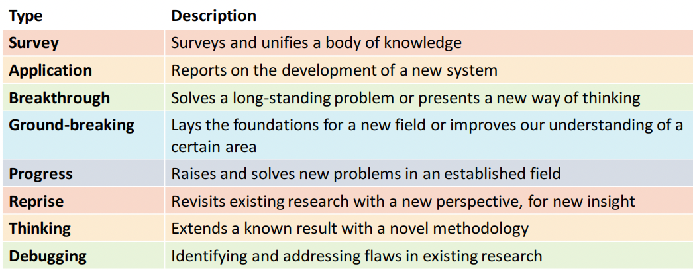
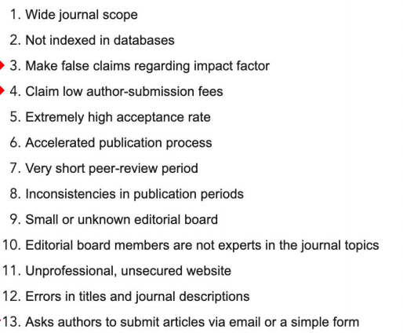
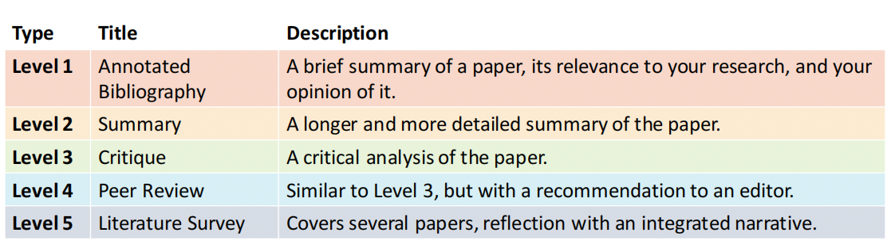

 ## 1. Research papers 研究论文
 
### 1.1 Primary vs Secondary Research
1. primary: based on raw data: high cost and time intensive
2. secondary: based on existing data

### 1.2 A taxonomy 分类学 of scientific article

 
### 1.3 Conference publications in computer science 6-12pages

### 1.4 The different types of “research paper/article”
1. Journal papers  20+
2. Full conference paper 6-12
3. Short conference paper  6
4. Late-breaking work / poster paper 2-6
5. Demonstration paper 2-6
6. Workshop paper 2-6

### 1.5 (More on) How to find research papers / to sort papers
1. Word of mouth / recommendations 
2. Knowing the field 
3. Searching for keywords and concepts 
4. Following authors 
5. Trail search 路径搜索
6. Citation search

### 1.6 Discuss the written assessed exercise
- Virtual Reality
- Augmented Reality
- Mixed Reality

## 2. Reading 
### 2.1  Research papers
1. Abstract: a brief synopsis摘要 of the contents;
2. Introduction: what it is about, motivation, significance of the work;
3. Background: prior work, context for research, background information;
4. Methods: describe research facts and experimental design;
5. Results: analysis of experiment results;
6. Discussion & conclusions: interpreting the results and their implications.

### 2.2 Read
1. title and abstract
2. introduction
3. conclusion
4. section headings and structure
5. figures
6. methodology
7. skip difficult
### 2.3 Summarizing papers

#### b.Summary
1. Summary: brief synopsis概要 of the paper.
2. Context: why did you read it and what have you learned?
3. Problem: what problem does the paper address?
4. Contribution: what are its claimed contributions?
5. Related work: briefly describe direct relevance to other papers you’ve read, or identify new papers to follow up on?
6. Methods: what methods were used to evaluate the solution?
7. Outcomes: what are the key findings of the paper?
8. Conclusions: what are the implications of this work – for the field and for your own research?
#### c. Critique
1. What problem does the paper address?
-  Is it an important problem?
-  Is this a novel solution or an incremental improvement?
-  What is the significance of the results and conclusions?
2. What are the claimed novel contributions of the paper?
- Do you agree with the claims?
3. What previous work is this research based on?
- Does the paper show good awareness of past research?
- Is it clear what is novel here compared to existing work?
-  Does the approach here contradict existing approaches?
4. What methods have been used?
-  Are they appropriate? 
-  Has the analysis been performed correctly? 
-  Is the analysis valid?
- Note: more on experimental design and analysis in later lectures.
5. What conclusions are drawn from the results?
- Are they correct?
- Does the evidence support the claims?
#### d. Peer review
- Be objective; Don’t let your own bias affect your judgement.
- Be fair; Behave like you would expect your own reviewers to.
- Be professional;  Authors might not know your identity, but the editors do!
- Maintain confidentiality;  Research is submitted for peer review in confidence, don’t share it.
- Be honest;  Show courtesy to the authors;
-  Be constructive建设性, suggest how to improve the paper, back up your criticism.
- 
#### e. literature Survey

## 3. Literature Review