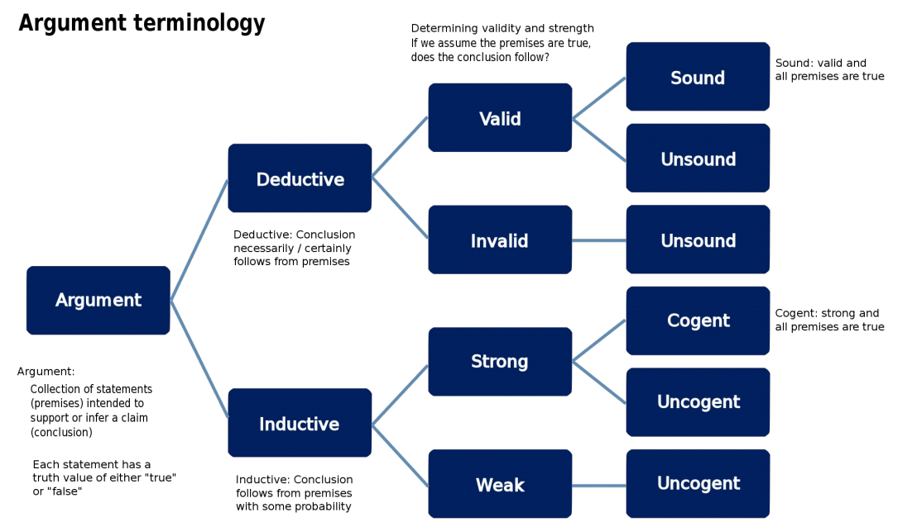
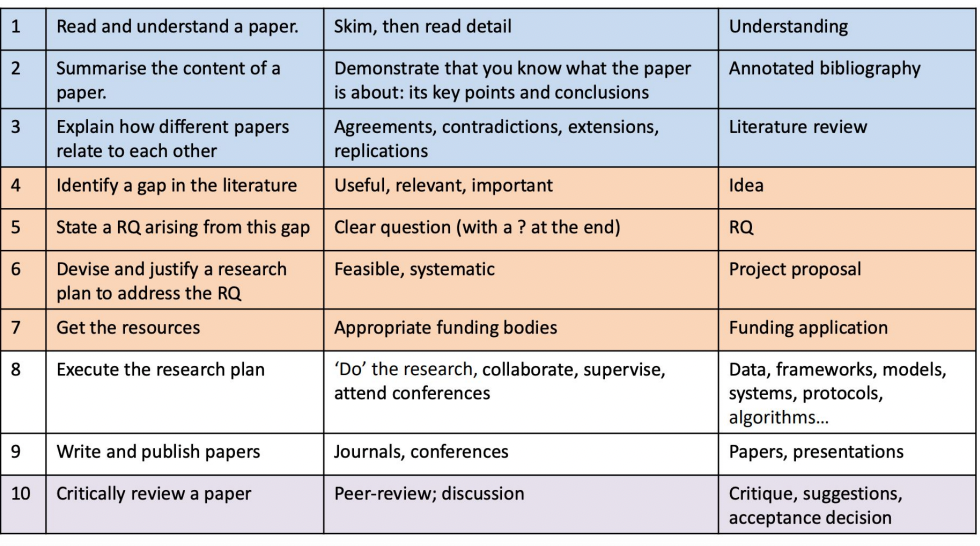
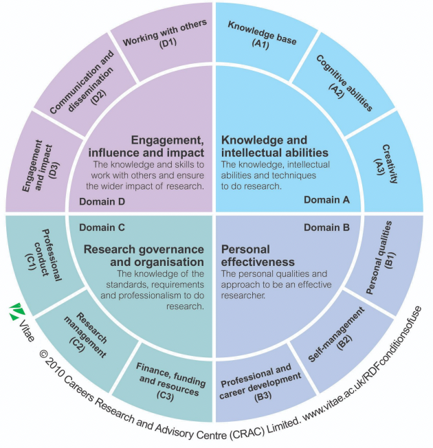

## 1. Argument

1. Deductive inference 演绎推理
2. Inductive inference 归纳推理
### 1.1 Fallacy 谬误
1. formal fallacy : structure of a deductive 
2. informal fallacy :  reasoning 推理 other than an improper logical form （content of argument）
### 1.2 straw man argument 稻草人争论
1. Person 1 asserts a proposition P
2. Person 2 misrepresent this proposition P, then makes an argument against this misrepresented proposition
### 1.3 Possibility vs probability 可能性vs概率
### 1.4 Judge a paper

## 2. Scientific Method
