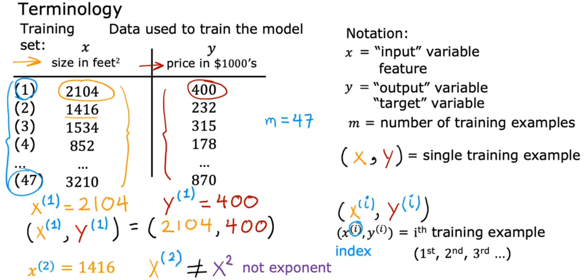
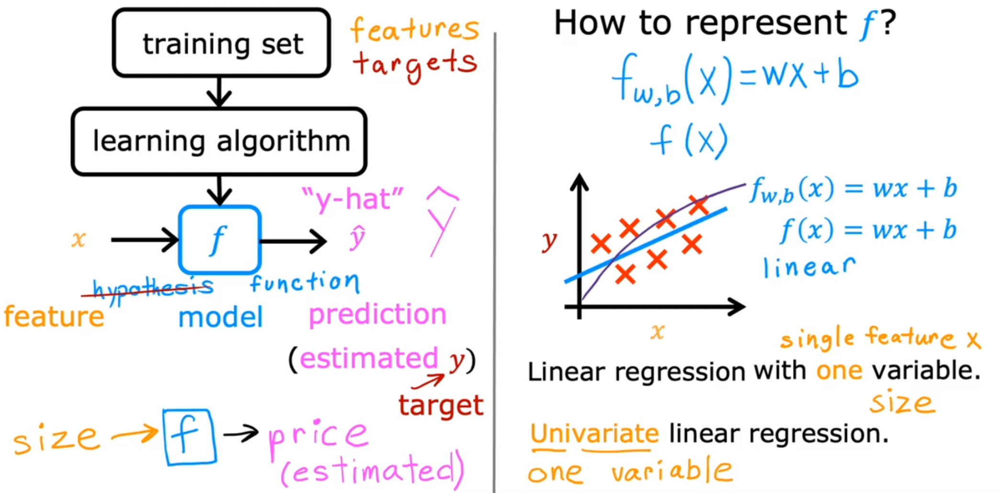
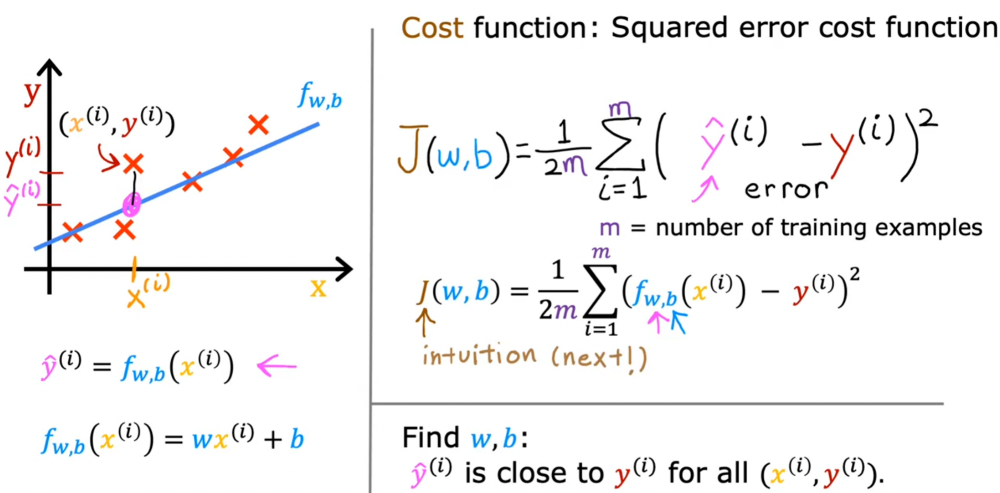

## 1. Supervised learning &  Unsupervised learning
### 1.1 Supervised learning 
x: inputs
y: output label
1. regression: 回归 housing price prediction
2. Classification: 分类 Breast cancer detection
| Regression              | Classification           |
| ----------------------- | ------------------------ |
| predict a number        | predict a category       |
| infinitely many outputs | small numbers of outputs |
### 1.2 Unsupervised learning 
| Supervised learning | Unsupervised learning |
| ------------------- | --------------------- |
| learn from label    | unlabeled data;  Find structure       |
1. clustering :DNA microarray, google news, grouping customers
2. Anomaly detection:异常检测 ： fraud detection in financial system
3. Dimensionality reduction: Compress data 
## 2. Linear regression model

### 2.1cost function
