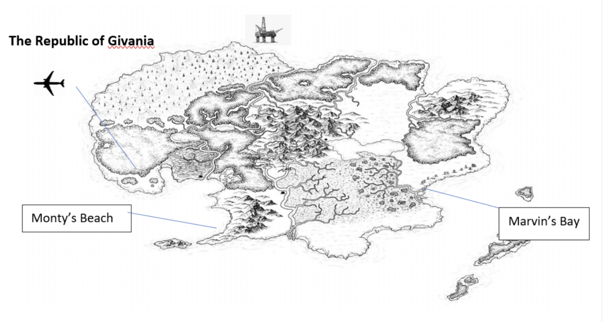
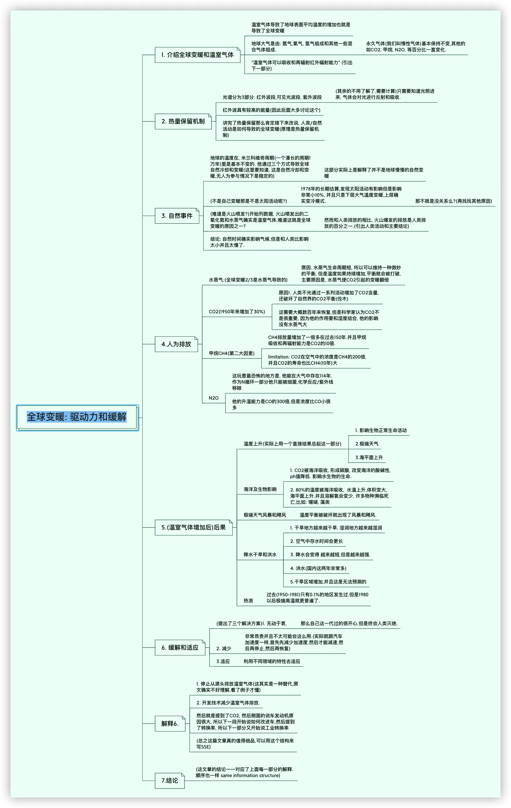

## Presentation (day 4)

### 1.Using Signposting Expressions

> Our group thought the most controversial point was…..   
>
> Point  X provoked the most discussion.   
>
> Point  X was the most controversial point.   
>
> There was some/a lot of disagreement about point X.   
>
> Some people felt…..   
> 
> Most of the group agreed…….   
>
> Others disagreed………….   

| Part                         | Signposting                                                  |
| ---------------------------- | ------------------------------------------------------------ |
| Introducing the presentation | Good morning/afternoon, ladies and gentlemen……… The topic of my presentation……….. Today I am going to talk about…….. If you have any questions, I would be happy to answer those at the end of the presentation. |
| Giving an overview           | This presentation will deal with three main points…… My presentation is divided into four sections…... First of all, I will ……then I will move on to examine…… and finally……. |
| Transition expressions       | Moving on to the next point…… Now I’d like to look at….. The third area which needs to be considered is…… And finally, my last point is …… |
| Referring to visual aids     | As you can see… From this chart/ table/graph, it’s clear that……… This graph/table/chart shows…… |
| Concluding the presentation  | Finally…... To sum up…. As this presentation has clearly shown, it is essential that…… Thank you for your attention……  are there any questions? |


####  Agree  
  
Yes, that’s a good point  
Yes, you’re (quite/absolutely) right  
That’s a good point  
That’s what I think  
  
#### Disagree  
  
But don’t you think…….?  
But what about……?  
  
I don’t see how you can say that…  
But there’s no evidence to suggest that/for that…  
I don’t think that’s right/true  
  
#### Partially agreeing than adding your own opinion  
  
I see what you mean, but….  
I take your point, but  
That maybe true, but  
Yes/perhaps but don’t you think that?  
  
#### Expressing doubt/reservation  
  
I’m not so sure about that  
Is there any evidence for that?  
  
#### Speaking and Listening conversation:  
  
‘Are you with me?  
‘Does that make sense?  
“Have you got that?’  
‘Is that clear?’  
‘Do you follow me?’


### presentation （day 22）
```
part1 🌟

1. Did the author study some cases in the article to determine this architecture. 
2. What does the author want to express in this text

part2 🌟

Hello, everyone.

Today, my text topic is autonomous/ɔːˈtɒnəməs/ vehicles and embedded_  
/ɪm'bedɪd/ artifical intelligence :The challenges of framing machine driving decisions
The article published in 2019 and the Information is reliable.


Autonomous driving brings social benefits, also carry some potential risks.
we need to frame the av decisions.

There are 2 main factors impact on the decison capacity of AI, which is safety argument and the ethical challenge.

I will focus on safety and ethic of autonomous vehicle.

1st
Although safety arugments is important to us and still have some problems, even we have some shoratages in data or researches
safety is one part of the av dicisions, we can take it into consideration, it cannot completely define automous vehical
 
2nd
the ethical challenges
now we still have ethical limitaion in society, such as the classic case trolley trɒli  dɪˈlemə. dilemma

The morality of mechine should not based on human ethic and value, we could not use the same morality build a new model to set 

In conclusion, framing av decision is compelx and is full of debates
we need to combinate these factors to build the frame of av.


part3 🌟
Question 1: You mentioned five discussions about the roadmap, which five areas are they?
Question 2: I remember you mentioned providing training in ethics and responsible innovation, I would like to ask who is this training being provided for?


part4 🌟
1.Is there any problems with safty argument?
there is no doubt that the self-driving will solve some distaction or fatigue of a driver，but it also bring some new accident problems

such as sensor error, programming bugs, unanticipated objects, classification error, and hardware faults.

alth the possiblity of them are small but they ara fatal to people.

2.Could you talk more detail information about the ethical challenge ?
in current, programming automous intelligent mechines identify , process and carry out decisions are still hard to apply human values and ethics

Also human ethicis have ethical limiation 
certain programming shoud be silimar with driving laws,codes social nomal
some people hold that the moral can be programming into machine intelligence
morality code


Question 1: You mentioned five discussions about the roadmap, which five areas are they?
Question 2: I remember you mentioned providing training in ethics and responsible innovation, I would like to ask who is this training being provided for?

a.What are the concerns regarding ethics in AI?

decision ai system，Personal privacy can be overcollected
Every netizen's information will be leaked and misappropriated
It may violate human rights，security cannot be guaranteed at present


b. What are the implications for autonomous machine learning?
reduce the recyle labor，
Can reduce the complex cycle of meaningless manual labor
May reduce the likelihood that some researchers will find future results

c.Will machines make better ethical decisions than humans?
intoxication, distraction, fatigue, and poor behavioural decisions such as speeding
i am not sure.
collect data to draw the decisions but 
Human morality cannot be expressed in code
moral pricinples not based on human decision

2.观点和主题

解释图表

3.主题部分

4.结束
Thank you for listening 
And now if there are many questions, I would be pleased to answer them
Thank you for your attention,
That’s an interesting question, I don’t know off the top of my head, but I’ll try to get back to you later with an answer

5.Q&A

```

## Simulation (day 5)

### 1.Background

```
The tiny independent island republic of Givania has recently been awarded £170 million pounds by 
the European Commission (EC) to make much needed improvements to the island’s infrastructure 
after being hit by a small earthquake several months ago. 
Much damage was done to several important sights on the island which require rebuild and or repair.
The island relies on summer tourism 
and is also an area of natural beauty with many rare bird and fish species that are endangered.
The money needs to be well spent to help secure its long-term future. 
Several applications have been received asking for money to help fund projects.
Now the Government has set up a commission to decide 
how the money will be spent and what money if any will be given to each project.
```


```
Area: 630 km2 
Population: 250,000
Capital: Marvin’s Bay
Climate:  Tropical
Unemployment rate:  13.5 %
Main Industry:  Tourism 70% of the economy
```

::: details 详情

**Tommy Traveller, project leader for Givania Tourist Board**

```
You want money to invest for improving the Golf Club at Monty’s beach and the Sea Scape theme park, both popular tourist attractions. 

Sea Scape in Marvin’s Bay requires urgent repairs to its swimming pool and water slide.
The park is extremely popular with holidaying families and the owner, Barry Kuda, will match the amount of money awarded for the upgrade, pound for pound.  

The golf club needs new facilities, including the club with shops and restaurants, and proposed 5-star spa hotel for wealthier tourists. 
The course requires improvements to become an official tournament venue, which will attract wealthier visitors. 
This will involve joint funding with the golf resort owner Mr Ty Gerwoods. 

You also want money to invest for developing and upgrading the current facility to a bigger and more modern airport to meet increased levels of tourism.  
There is currently very poor internet connection and shopping facilities at the airport which is also looking run-down having its last upgrade in 1991.  
The runway also needs repaired as many airlines are complaining of both the financial and time costs caused by having to make repairs due to their aircraft because of the uneven runway surface. 

1. You want £95million for these projects
2. Decide how much money you want for each part of the project (The gold resort is a joint investment) and what benefits these projects will bring to the island
```

### 2.Speach--The Sea Scape theme park

##### a.Services

| Services            | Details                                                      |
| ------------------- | ------------------------------------------------------------ |
| Heated Pool         | We work to maintain the temperature of the pools to a comfortable range of 86-88 degrees. |
| Zero Depth Entry    | The beach like design is perfect for toddlers to wet their feet and for older kids to flaunt their swimming skills. |
| Water Slides        | Speed through the tube slide, zip down the body slide or take the plunge from one of two drop slides. |
| Diving Area         | Whether you’re perfecting your swan dive or just braving the straight jump, we have the perfect platform. |
| Water Playground    | Tots not ready to swim can splash and play the day away at the water playground, offering exploratory play equipment in the zero depth area of the pool. |
| Seafare Concessions | Enjoy healthy and tasty snacks, wraps, pizza, pasta, salads, smoothies, and more. |
| Others              | Swimming courses, Party, Hosting Event.....                  |

##### b.Costs

|         | Swimming pool                                                | Customized Water slide                                    | Others                             |
| ------- | ------------------------------------------------------------ | --------------------------------------------------------- | ---------------------------------- |
| Related | https://homeguide.com/costs/inground-pool-cost               | https://willygoat.com/collections/commercial-water-slides |                                    |
| Summary | Fiberglass + Concrete + Vinyl + Install + Yearly Maintenance...... | Designers + Build-related + Guarantee.....                | Ships,Tent, Emergency  facilities, |
| costs   | $ 20,500,000                                                 | $5,000,000                                                | $500,000                           |

Total:$ 26,000,000+

##### c.Revenues

| Revenues           | Details                                                      |
| ------------------ | ------------------------------------------------------------ |
| Pool Rates         | Monday-Thursday:     $10/person   $9 seniors     $5 after 5:00pm Friday, Saturday & Sundays:$12/person    $10 seniors     $6 after 5pm |
| Season Pass        | Individual:  $89/$96     Family of 2:  $154/$169             |
| Party Tent Rentals | Small: $175 for 2 hours.   Large :  $300 for 2 hours         |
| Swim               | Monday-Thursday:     $10/person.      $9/senior.  $5/person after 5pm Friday, Saturday, Sunday:   $12/person,     $10/senior    $6/person after 5pm |

https://www.heparks.org/parks-facilities/seascape/

Total:$30,000,000+

##### d. Conclusion

Benefits:

- Revenues
- Employment rates
- Image of Givania

:::

## Seminar (day 9)

### 1. To prepare consider the questions below:

::: details

>a. How concerned are you about the environment?
>
>Climate change, sea level rising, species extinction....
>
>
>
>b. How green are you?  
>
>I purchase as few new clothes as possible because the clothing industry is the second largest consumer of oil every year
>
>I rarely drink bottled water to reduce the environmental pollution caused by plastic bottles
>
>I turn off the lights and water to protect the earth's limited resources
>
>
>
>c. Who is responsible for protecting the environment?  
>
>Every inhabitant  should do little things around us to protect the earth.
>
>The organizations should research good solutions and propaganda.
>
>The government can issue relevant policies and regulations to force people to protect the environment.
>
>
>
>d. Governments worldwide have introduced **green** policies to cut carbon emissions or invest in renewable energies.  What is the situation in your country?
>
>My hometown has completely adopted electric buses replaced gas trucks.
>
>Our country has issued relevant policies, and greenbelt many deserts, 
>
>Individual should 
>
>all of us should 
>
>

:::

### 2. Exploring your stance / standpoint

::: details

>Compare the following two statements. Which do you agree with?  Make a note of your reasons and then discuss your responses in your groups.
>
>a. It is the responsibility of the individual to protect the environment.
>
>Both
>
>b. It is the responsibility of organizations, companies, local and national government to protect the environment. 
>
>Both

:::

### 3. Using texts to support seminar discussion

:::details

>Your seminar discussion will revolve around your response to the statement: 
>
>**“It Is no longer about who is responsible for global warming but how we try and solve it.  It will require a variety of responses from governments, private sector and individuals.  However, more importantly, action is needed now.”  (Givan, 2021)**
>
>Your teacher will assign you a text. See the links below.  These are long articles so make sure you use your reading strategies to identify the important sections before focusing on these to make your notes. 
>
>

:::


Confirming understanding when listening

1. So what you’re saying is……
2. So in your view……..
3. If I understand you correctly………

Checking understanding when speaking

1. Do you understand what I mean?
   Do you follow what I am saying?
   Am I making sense to you?

Showing you do not understand

1. I’m not sure I understand what you mean
2. I don’t quite follow you.  Could you explain that again?
3. Could you repeat that?


::: tip

[https://odysee.com/@flukedog:a/youTube-file:c](https://odysee.com/@flukedog:a/youTube-file:c)

:::


## Seminar discussion (day 10)

### 1. Who is responsible for caring for the environment?

It is the responsibility of the individual to protect the environment.  We as individuals are responsible for global warming

### 2.TEXT D: Global Warming: Review on Driving Forces and Mitigation 



## Seminar discussion & exam practice (day 14)🌟

### 1.Renewable vs nuclear energy

| Stages    | Tasks                                                        | Example                                                      |
| --------- | ------------------------------------------------------------ | ------------------------------------------------------------ |
| 2 min     | Each student will present a **summary** of their text        | e.g. My text  ‘ TITLE’  talks about… Author’s Name / The article argues / highlights / points out… |
| 2 min     | The members of the group will ask **1/2 questions** about the text; <br/>Each student responds to the questions. | e.g. Actually, what I meant to say was…Ah, yes, the paper argues….No, that’s not quite right…. |
| 20-25 min | Group will then discuss the topic.                           | See the ‘useful language’ section in this lesson for inviting people to share their opinions etc.. |
| 30 sec)   | Conclude the discussion.                                     |                                                              |

### 2.Questions

a. Is Nuclear fuel the most cost-effective way to meet the world’s energy demands?

b. Green energy is making an impact. Is there a future for fossil fuels?

c. What can be done with nuclear waste?

### 3. Useful language

| Purpose                                  | Examples                                                     |
| ---------------------------------------- | ------------------------------------------------------------ |
| Inviting people to share their opinion   | What are your views on this?<br/>Do you agree/disagre        |
| Presenting your own opinion              | It seems that....<br/>In my view….<br/>Well, I think....     |
| Countering the other person's opinion    | I take your point, but....<br/>Well, I'm not sure if that is quite true....<br/>I understand what you are saying but...<br/>But surely... |
| Taking your turn                         | Can I just come in here?<br/>Can I add something here?       |
| Take back the topic                      | Come back to what .. said earlier...<br/>I think I agree with the point you made earlier.<br/>To back to my earlier point... |
| Offer each other opportunity to continue | Go head.<br/>Thanks. I think...                              |
| Help a quiet student speaking            | Nikki, did you want to make a point?<br/>I think Carla is trying to make a point |

## Pronunciation practice

1. BBC : A series of videos demonstrating how certain sounds are made in English. 

[https://www.bbc.co.uk/learningenglish/english/features/pronunciation/introduction](https://www.bbc.co.uk/learningenglish/english/features/pronunciation/introduction)

2.  A college in the US. It contains animations showing how individual sounds are made accompanied by recorded examples of the sounds being used in words and sentences.

   [https://tfcs.baruch.cuny.edu/consonants-vowels/3](https://tfcs.baruch.cuny.edu/consonants-vowels/3)

3. An informal site providing you some advice on how to stop translating in your head and improve your conversational English. 

[https://rachelsenglish.com/stop-translating-in-your-head/](https://rachelsenglish.com/stop-translating-in-your-head/)

For a fun way to check out the pronunciation of new words and phrases in context, you can try Youglish.

[ https://youglish.com/]( https://youglish.com/)

 
