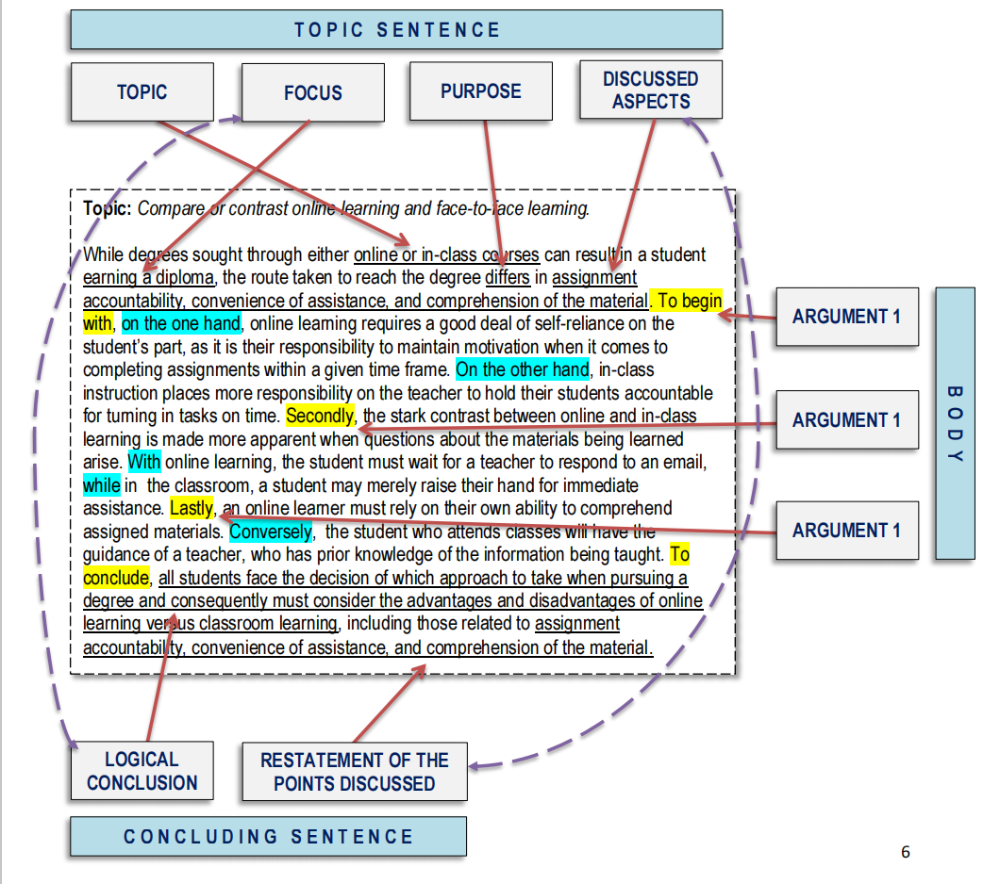

# Topic Sentences

## TOPIC SENTENCES: TOPIC, FOCUS, AND PURPOSE

1. Topic
2. Focus (controlling idea)
3. Purpose

| Topic     | Not                                                       |
| --------- | --------------------------------------------------------- |
| Assertion | statement of fact or an observation                       |
| Stand     | announcing a subject                                      |
| Main idea | a title (complete sentence that explains in some detail ) |
| Narrow    | Borad                                                     |
| Specific  | Vague & general                                           |
| One point | several main points                                       |

## Supporting sentences

>1. Refer to Topic, 
>2. contain no irrelevant
>3. Logically arranged

## Concluding sentences

>1. end of a paragraph
>2. clearly signals 
>3. Restate the discussed point in different words
>4. Present the logical conclusion arrived at based on supporting sentences

## Expository paragraph:  structure

