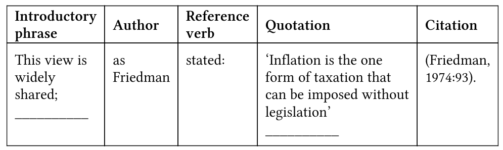

## The Writing Process 
### 1. Basics of Writing 
| Basic     | Detail                                                                                                                                                                                                                                                                                                                                             |
| --------- | -------------------------------------------------------------------------------------------------------------------------------------------------------------------------------------------------------------------------------------------------------------------------------------------------------------------------------------------------- |
| Purpose   | research? question?discussion?                                                                                                                                                                                                                                                                                                                     |
| Features  | accurate                                                                                                                                                                                                                                                                                                                                           |
| Type      | Note, Report, Project, Essay, Thesis, Paper                                                                                                                                                                                                                                                                                                        |
| Format    |   |
| Component | Title-> subtitle -> heading -> sentences ->   phase -> paragraph                                                                                                                                                                                                                                                                                   |
  

### 2.Reading: Finding Suitable	Sources

| Sources      | Detail                                                                                             |
| ------------ | -------------------------------------------------------------------------------------------------- |
| Academic     | Identify the sources                                                                               |
| Type         | Website / Journal article / Official report	/ Newspaper	or	magazine article / E-book / Edited	book |
| Reading list | not read every word, only read the chapters                                                                              |
| library      |                                                                                                    |

### 3.Reading: Developing	Critical Approaches

| Part                           | Approaches                                                     |
| ------------------------------ | -------------------------------------------------------------- |
| Title, subtitle, text features | Author ? publication?                                          |
| Abstract                       | a) Background position b) Aim and thesis	 c) Method d) Results |
| Fact and opinion               |                                                                |

### 5. Understanding Easy title
Title -> Brainstorming -> Length -> Outline

### 6.Finding key point & note-making

Key point & relevant points

Note making

1. Use	your	own	words	and	not just copy phrases
2. A few	points	or	a	lot	of	detail. 
3. Always record the source	of	your	notes.	
4. Keep them simple.
5. Lists, organize	the	information.
6. Symbols	(+,	>,	=)	to	save	time. 
7. Abbreviations	(e.g.	govt.	=	government).

### 7.Summary & paragraph

| summary                | Paraphrasing         |
| ---------------------- | -------------------- |
| Reduce information     | Restate information  |
| Reorganizing structure | different structure  |
| Key points             | different vocabulary |
| Read text & check      | same meaning         |
| Underlying Key words   |             Keep some phrase         |
| Check summary (accurate & important)                       |                      |

### 8.References & Quotations

#### References
| References | Example                         |
| ---------- | ------------------------------- |
| Verbs      | Smith(2009) argues/claimed that |
| Systems    | APA 7                           |
| Secondary references           |     McEwan	(2015),	cited	in	Kelman	(2016:45),                            |

#### Quotations

#### Citations
| Abb     | Example                                                         | Details                            |
| ------- | --------------------------------------------------------------- | ---------------------------------- |
| et al.  | Many Americans fail to vote (Hobolt et al.,	2006:137)           | 3+ authors                         |
| ibid.   | Older	Americans	are	more	likely	to	vote	than	the	young	(ibid.). | same source ,same page as previous |
| op cit. |                                                                 | same source, different pages       |

### 9. Combining sources

Referring to sources
Taking a critical approach
Combining three souces

### 10. organising paragraphs

### 11.Introductions and conclusions

### 12. Rewriting and proofreading

## Elements of Writing

### 1. Arguments and Discussions

### 2.Cause and Effects

### 3. Comparison

### 4.Definition

### 5.Examples

### 6.Generalization

### 7. Problems and Solutions

### 8.Visual information

## Language Issue

### 1. Cohesion

### 2. Definite Articles

### 3.Numbers

### 4.Passive & Active

### 5. Punctuation

### 6. Singular or Plural?

### 7.Style

### 8. Time Markers

## Vocabulary

### 1.Approaches to Vocabulary

### 2. Abbreviations

### 3.Nouns & Adjectives

### 4.Verbs & Adverbs

### 5.Conjunctions

### 6.Prefixes & Suffixes

### 7. Prepositions

### 8.Synonyms

## Writing models
